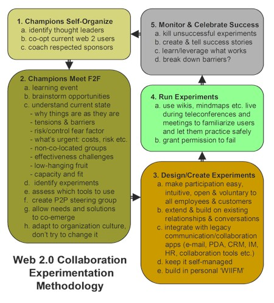

# A Methodology for Web 2.0 Collaboration Experiments (in Reluctant Organizations) {#a-methodology-for-web-2-0-collaboration-experiments-in-reluctant-organizations}

_Date posted: 27 April 2007_

Dave Pollard hits every nail on the head with this clear methodology for how to get new ideas played with and adopted in reluctant organisations. I hope he doesn't mind but I've reproduced the diagram here:Source: [Dave Pollard](http://blogs.salon.com/0002007/categories/businessInnovation/2007/04/25.html)There's a whole load of detail under each one of these. But for me, the critical one is the three groups of champions:

1.  the organization's thought leaders � people who, regardless of seniority or title, are considered innovative and 'ahead of the curve',
2.  current users of web 2.0 applications � kids who use blogs and wikis and RSS feeds and mindmaps and forums and people-finders and social bookmarkers and all the other social networking tools, and can get the others up to speed on how and when to use them effectively, and
3.  'respected sponsors' � people whose use of new collaboration methods and tools will raise eyebrows and get others on-board for fear of falling behind, and who will invest the time to use these methods and tools continuously and regularly, not just during a one-shot launch.

It's a case of getting bottom-up, middle-out and top-down all happening at the same time. Oh, if only it were that simple!