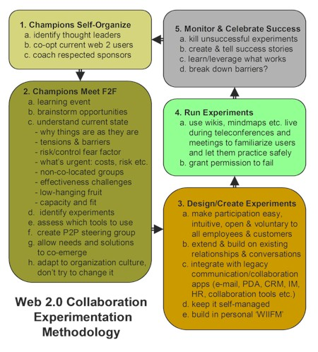

# Internet

## A Methodology for Web 2.0 Collaboration Experiments (in Reluctant Organizations) {#a-methodology-for-web-2-0-collaboration-experiments-in-reluctant-organizations}

_Date posted: 27 April 2007_

Dave Pollard hits every nail on the head with this clear methodology for how to get new ideas played with and adopted in reluctant organisations. I hope he doesn't mind but I've reproduced the diagram here:Source: [Dave Pollard](http://blogs.salon.com/0002007/categories/businessInnovation/2007/04/25.html)There's a whole load of detail under each one of these. But for me, the critical one is the three groups of champions:

1.  the organization's thought leaders � people who, regardless of seniority or title, are considered innovative and 'ahead of the curve',
2.  current users of web 2.0 applications � kids who use blogs and wikis and RSS feeds and mindmaps and forums and people-finders and social bookmarkers and all the other social networking tools, and can get the others up to speed on how and when to use them effectively, and
3.  'respected sponsors' � people whose use of new collaboration methods and tools will raise eyebrows and get others on-board for fear of falling behind, and who will invest the time to use these methods and tools continuously and regularly, not just during a one-shot launch.

It's a case of getting bottom-up, middle-out and top-down all happening at the same time. Oh, if only it were that simple!

## A beginner's guide to using the internet safely {#a-beginner-s-guide-to-using-the-internet-safely}

_Date posted: 3 October 2011_

What advice around internet safety would you give to someone who is relatively new to using the internet, or social media in particular? Here's my starter for nine, followed by a link to some official advice:

1.  **People aren't always who they say they are.** That applies to websites too. Always make sure you get a second opinion from someone you trust.
2.  **Your emails are your soft underbelly.** If someone can get to your emails, they can change your password on most of the systems you'll be using. Your email password should be the strongest one you have.
3.  **You are what you write.** If you're posting on social media sites, writing comments on blogs, discussing things in forums etc, you'll build up a reputation that's based entirely on those. How do you want people to view you and the organisations you're associated with?
4.  **Assume that nothing can be deleted.** As soon as you write something, assume that it's there forever. The website owner might retain a copy, Google will retain a copy, and the Internet Archive will probably retain a copy. If it was on Twitter, it will be stored forever by the [Library of Congress](http://blogs.loc.gov/loc/2010/04/how-tweet-it-is-library-acquires-entire-twitter-archive/).
5.  **Assume that nothing is private.** Don't write down anything that might upset your children, your parents or employer. It might (and probably will) come back to haunt you. If you're not sure whether to publish, then ask someone!
6.  **Your browser is your gateway and gatekeeper.** Your internet browser (whether Internet Explorer, Chrome, Firefox etc) is the way to get to a huge range of resources. If you keep your browser up-to-date, it can also act as a very effective gatekeeper - keeping you away from sites that are trying to grab your personal details, or take over your computer.
7.  **The risks change frequently.** Make sure your firewall and anti-virus software is kept up-to-date. If you don't know what these are, then get advice and follow it.
8.  **Backups help you sleep at night.** What would you do it you computer got destroyed or stolen, or even simply broke down? Is there anything on it that would be difficult to replace? If yes, then make sure you know that there's a second copy somewhere else - preferably made automatically, so you don't have to worry about it. But make sure you can get to that copy when you need it too!
9.  **Check everything before you report it as fact.** The internet is full of hoaxes and misinformation. They are usually quite easy to check out before passing on. Just put some of the key terms into a search engine to see if any of the hoax tracking sites know of it.

I would strong recommend the [Internet Safety pages](https://www.thinkuknow.co.uk/Parents/InternetSafety/) put up by CEOP. And they're not just for children!