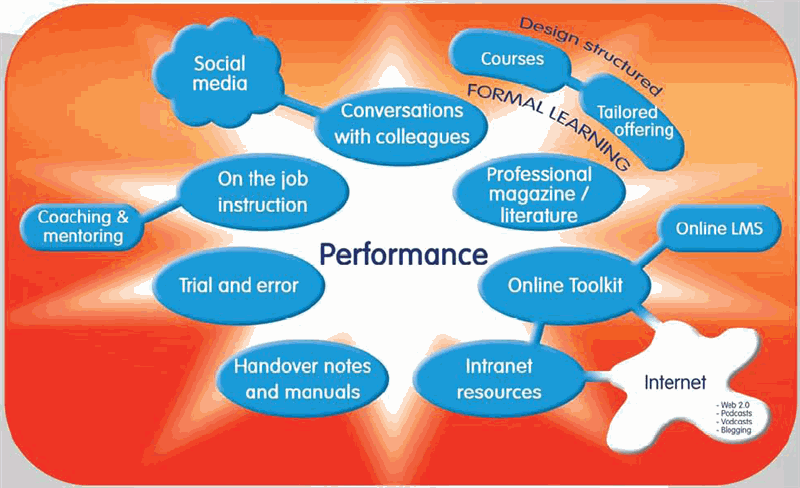

# Organisational learning &amp; development

## Training - it's what you do to a dog {#training-it-s-what-you-do-to-a-dog}

_Date posted: 2 July 2008_

For a while I've been wondering about the words we use to describe our profession. Like [Donald Taylor](http://www.trainingzone.co.uk/cgi-bin/item.cgi?id=185067&d=1), I'm not convinced that learning & development really can be considered a profession until we have a clear set of standards by which we can measure ourselves. Part of that includes tightening up on our language. My dog is three years old. By now she's learnt where she can relieve herself and the bits of the house she's not allowed in. She occasionally walks to heel and, even more occasionally, comes back when I call her name. Why does she do that? Because she's associated particular behaviour with either reward or punishment. We call that "training". I know very little about tennis, but, to my untutored eyes, Andy Murray has become a considerably better tennis player over the past year. How has he done that? Through considerable work, with his coach, to make his body react faster and his muscles stronger. We call that "training". A few years back I became the manager of a small team. All new managers had to learn about the company's appraisal processes. I spent one day with a group of other managers and an expert in appraisal. By the end of that day I was allowed to perform appraisals. We call that "training". What are the similarities here? For each scenario there is an expected outcome - a particular behaviour or characteristic that is required. In the case of the dog it's keeping to her part of the house. For Andy Murray it's being stronger & faster than his opponents. For the manager it's being able to get the best out of the appraisal process. For each scenario there was also an external input of some sort. Someone who sets the standard, can provide immediate feedback and suggest ways in which the expected outcome can be achieved. And what are the differences? The dog was motivated to change her behaviour because she learnt to associate it with reward or punishment (extrinsic motivation). Andy Murray is motivated to change because, I guess, he wants to win (intrinsic motivation). I was motivated to change because... well, I'm not sure really. Changing a dog's behaviour takes time and constant, ongoing reinforcing feedback. Andy Murray's new speed and strength certainly didn't come about overnight, and again will require constant practice and feedback to maintain it. My ability to perform appraisals was expected to be developed over the course of one day and no-one since then has given any feedback on how I do them. So what does this mean for the world of "training" in the workplace? If we (the learning professionals) a're going to do training properly we need to:

*   Be clear about what the expected outcomes are - not that we have to make that explicit to the trainee up front, but at least we should be certain about where we're heading. Training is very different from [informal learning](http://informl.com/2006/05/20/what-is-informal-learning/) as it's focussed on externally derived outcomes.
*   Make sure the trainee is given access to an external input who can set the direction of travel and provide feedback and guidance to reinforce the correct behaviour.
*   Ensure that trainees have clear motivation to change. Without that motivation we are wasting our time. cf. Motivation post. Motivation may be intrinsic (I want to do my job better), or extrinsic (if I do this I will keep my job / get a pay rise / impress my manager).
*   Forget the idea that you can take short cuts. Good training is hard work - requiring ongoing coaching and feedback.

### Training that works {#training-that-works}

If we take those principles into account, then what will an effective, large scale, training regime look like. I would suggest a threefold strategy:

1.  Build in extrinsic motivational factors - most of your trainees will need them. How this works will depend on your organisation, but may include financial reward, status, or recognition. Negative reinforcement may include being able to continue in a particular role or even the removal of certain privileges. Note, I'm not recommending this, just saying that it's a possible motivational factor. Positive reinforcement is always much more effective long term.
2.  Expect managers (at all levels) to be coaches and to provide ongoing, reinforcing feedback. The [Manager-Tools advice](http://www.manager-tools.com/manager-tools-basics) on feedback and coaching is invaluable here. This is a major change to the role of most managers - but will be far more effective than expecting a one-hit training workshop to make a difference back in the workplace.
3.  Provide external input which sets the standard and gives examples of "correct" behaviour. Use resources like videos, posters, briefing papers, elearning packages, even a face-to-face workshop with an expert, to ensure a consistent message is available right across the organisation. The precise medium will depend very much on the type of message and who you're training.

You'll see that the training department is not the only part of the organisation involved in training. It should include senior management to model the coaching & feedback regime, HR to set reward policies, and Internal Communications to ensure messages are consistent and presented well. Training is, and never can be, a fix for poorly designed processes, systems and user interfaces (just see the [Terminal 5 debacle](http://news.bbc.co.uk/1/hi/uk/7314816.stm) for an example).

### Training not development {#training-not-development}

Those people who know me will be wondering what's happened. I'm normally a died-in-the-wool constructivist in my approach to learning. The thing is when we're trying to induce specific behaviours & capabilities, then we need a far more behaviourist approach, as proposed above. Constructivist approaches work when we are taking a developmental strategy - where there are no "right answers". If that's where you're heading, then you don't want "training". What examples would you say are training and which are development? With thanks to [Donald Clark](http://donaldclarkplanb.blogspot.com/2008/06/7-bad-language-habits-in-learning.html) for the impetus to put these thoughts down.

## The Networked Learner and Trainer {#the-networked-learner-and-trainer}

_Date posted: 28 November 2008_

[Connectivism](http://www.elearnspace.org/Articles/connectivism.htm), a learning theory put forward by [George Siemens](http://www.elearnspace.org/blog/), has been around for a few years now. Basically, it takes the view that learning is a process of making and breaking connections. Those connections can be internal (inside your brain), with other people, or with external knowledge systems (eg. Wikipedia). Over the past 12 weeks, George and [Stephen Downes](http://www.downes.ca/) have been leading a world-wide course with learners who wanted to understand and put into practice the principles of connectivism. [Wendy Drexler](http://teachweb2.blogspot.com/) was one of those learners. She has concluded the course by creating a [5 minute video](http://teachweb2.blogspot.com/2008/11/cck08-connectivism-networked-studentthe.html) (also shown below) in a similar style to [The Commoncraft Show](http://www.commoncraft.com/show). It explores how a real-life student might use connectivist principles within a particular subject area. It explains how, by using a range of tools and by making connections with other people, he can develop his own body of knowledge. The video then asks the question: "So, why does he even need a teacher?" In a connectivist learning environment, the teacher's role changes significantly. Rather than being the source or gatekeeper of knowledge, they become:

1.  Learning Architect - putting together the big picture, helping to choose the tools, providing a sense of direction
2.  Modeller - providing an example of how to learn
3.  Learning Concierge - a source of information and support when required
4.  Connected Learning Incubator - providing the conditions in which networked learning will thrive
5.  Network Sherpa - guiding the way around the network
6.  Synthesizer - pulling together collected ideas
7.  Change Agent - stimulating knowledge construction

All of these are applicable in any institutionalised learning context, whether school, college, university, or the workplace. The difference in the workplace, though, is that many consider learning to happen on the odd day when someone is sent on a training course. In reality, very little true, long term learning takes place on these. Most learning happens in the workplace itself - where your colleagues and your managers take the roles above (often unconciously). To make learning more effective in the workplace, I would argue that we need to make those roles explicit, and develop them in managers in particular. Perhaps through something like the [Learning to Learn initiative](http://www.learningconversations.co.uk/main/index.php/2008/01/04/more_bang_for_your_buck) I proposed earlier this year. So, what is the role of the external (or even internal) trainer? Ideally, trainers would have a medium to long term relationship with their trainees. This would allow them to take on the roles above. That long term relationship doesn't have to be face-to-face, but it must exist. Forget the idea that you can take short cuts. Good training is hard work - requiring ongoing coaching and feedback. (See article: [Training - it's what you do to a dog](http://www.learningconversations.co.uk/main/index.php/2008/07/02/training-it-s-what-you-do-to-a-dog)) The relationship can be built and supported using available mass-communication techniques - podcasts, forums, blogs. That way, when a face-to-face event does take place it will be far more valuable to the learner as they already have an understanding of the subject matter and the trainer's perspective. The face-to-face event will then be able to focus on practising skills, on coaching and on providing a stimulus towards the next element of change that's required. (See this [description of the Manager-Tools conference](http://www.learningconversations.co.uk/main/index.php/2007/06/22/what_s_in_it_for_me) for an example) If we continue to treat training as a one-off activity, then we will limit its effectiveness, and thus the long term viability of the training department. (See [Harold Jarche's timely warning](http://www.jarche.com/2008/11/wake-up-and-smell-the-coffee/)) [youtube]XwM4ieFOotA[/youtube]

## Would anyone notice if we stopped training? {#would-anyone-notice-if-we-stopped-training}

_Date posted: 9 February 2009_

How much of what we call training is actually just ticking boxes for someone else's report? What would be the _real_ impact if you called a halt to all training activity in your organisation? Would anyone notice? When people come to you and say we need training, do you ever ask them why? Keep saying "Why" until you get back to the real heart of the problem, then, and only then, can you suggest a possible solution. That might include training, but it also might include:

*   changing systems & processes
*   providing performance support (eg. like Google does so well)
*   making sure managers are managing
*   encouraging sharing of knowledge
*   better internal communications (the vital link between internal comms and training is something I want to explore further - later)
*   improving recruitment to find people who are ready to learn

What proportion of your training activity actually produces meaningful performance improvements? And, if we're not improving performance, why are we training? (Inspired by something [Donald Clark](http://donaldclarkplanb.blogspot.com/) said, but I can't remember where it was!?)

## The state of corporate learning and development {#the-state-of-corporate-learning-and-development}

_Date posted: 25 March 2010_

Whatever we might like to think, our corporations are not isolated from the surrounding society. In the developed world the brand names, web sites, and tools shown as examples here are playing a major part in how our society operates, consumes, communicates and learns.

### Key trends in society {#key-trends-in-society}

In the past few years, the following seem have been some of the major trends:

*   Internet use, and particularly broadband (2Mb/s or above) has grown phenomenally. In the UK, in 2009, [70% of households had access to the internet](http://www.statistics.gov.uk/cci/nugget.asp?ID=8).
*   Mobile phone use has grown hugely. In 2008, [more than 60% of people in the world owned a mobile phone](http://www.itindustrynews.co.uk/60-of-worlds-population-using-mobile-phones-says-united-nations-873.html).
*   When people use the internet to find out something, they usually start with a search engine rather than any particular information source.
*   Knowledge is being democratised. There is now virtually no barrier - apart from your own time - to start publishing, whether its video, audio, text or even real books.
*   In a rapidly changing world, any individual or organisation needs to be resilient (able to have alternative ways of doing things), flexible (able to change direction quickly) and maintain good connections (to ensure that you're always up-to-date.
*   Organisations are losing control of their message. Your customers (and other interested parties) may be pushing alternative messages. They are on an equal footing to you. Just take a look at the short video below: [youtube]tPgQsv2KPwc[/youtube]

### Key trends in learning {#key-trends-in-learning}

Alongside the above trends in society, things are also changing in the world of learning and development:

*   We're rethinking the established practice of providing training as a panacea for every performance problem.

    > "... it's those who consider training as the last resort rather than the first resort who are the engineers of high performance." ([Phil Green on this site](http://www.learningconversations.co.uk/main/index.php/2010/01/30/reflections-on-learning-technologies-2010-lt10uk?blog=5#c1159))

*   We're realising the value of "[informal learning](http://www.c4lpt.co.uk/handbook/informallearning.html)". In a 2010 report on managers talking about their own learning:

    > "the most frequent and effective learning activity is having a chat with a colleague". ([How managers learn - in their own words](http://goodpractice.com/resources/how-managers-learn-in-their-own-words-white-paper/))

*   There is now no excuse for learning and development professionals not to keep up with developments and current thinking. We can attend free international online conferences like [Learntrends](http://learntrends.ning.com/page/learntrends-2009) , join in with free webinars such as those provided by the [Learning & Skills Group](http://learningandskillsgroup.ning.com/) (invitation required - if you need one, drop me a line), and improve our own management capabilities using the [Manager Tools podcast](http://www.manager-tools.com/manager-tools-basics) and [forums](http://www.manager-tools.com/forums).
*   There's been a massive growth in authoring tools (see table below for examples). Many are free. And many even allow groups of people to collaborate on a single resource. Some you'll have to install, but some are just websites that you log into.

    | Media type | Tool |
    | --- | --- |
    | Text editing | Google docs, Zoho |
    | Mini-websites | Wikispaces, PBwiki, Mediawiki |
    | Quizzes | Hot potatoes, Articulate quizmaker |
    | Screen capture movies | Captivate, Jing, Camtasia |
    | Video editing | Jaycut, iMovie, Windows movie maker |
    | Diagrams | Gliffy, Mindmeister |
    | Micro-blogging | Twitter, Yammer |
    | Blogging | Wordpress, Blogger, b2evolution |
    | Presentation support | Prezi, Google Docs, Zoho |
    | 3D models | Google Sketchup |
    | Online tutorials | Xerte, Articulate, Lectora, Atlantic Link |

    Jane Hart has the [best list of tools](http://www.c4lpt.co.uk/Directory/index.html), both free and paid for, on her Centre for Learning & Performance Technologies site.

### So where is L&D heading? {#so-where-is-l-d-heading}

Based on the trends that are happening, I believe that we will see some significant changes in the way Learning & Development operates within our organisations:

*   There will be far more use made of low cost, synchronous tools for video-conferencing, instant messaging and web meetings (webinars)
*   We will move away from the Learning Management System as a delivery tool (see my [reflections (and the comments) on Learning Technologies 2010](http://www.learningconversations.co.uk/main/index.php/2010/01/30/reflections-on-learning-technologies-2010-lt10uk?blog=5)). We are starting to realise (at last!) that learning cannot be managed.
*   Instead the LMS _can_ play a part in supporting evaluation. But we must remember the maxim: **Make the important measurable, not the measurable important.** This means using the LMS to get more useful feedback from managers about whether performance has improved following an intervention provided by L&D.
*   There will be a move towards social learning, in particular user-generated content inside the firewall. A number of companies are already seeing great success in this: [BT](http://www.youtube.com/watch?v=gtVYkEdGtfo) and [Cash America](http://learningwiki.editme.com/322) are two excellent examples.
*   Workers inside the firewall will be able to use the learning tools they use (such as Twitter and Facebook) outside the firewall.
*   Learning will happen across the firewall. Employees will learn from customers and vice versa.
*   There will be far more use of simulations and serious games. Tools, like [Thinking Worlds](http://www.thinkingworlds.com/) will allow "normal" people to create such interventions.
*   We will start to make more use of the technology people have in their pockets. Social communication tools like Yammer already integrate with SMS (texts). Augmented reality (where your camera picture is overlaid with extra detail from an application) is starting to be seen in [practical training situations](http://www.youtube.com/watch?v=mn-zvymlSvk). Just being connected to the internet means that you can always have have access to your performance support materials - whereever you are.
*   In order to keep up with the rapid changes in society and in your organisations, L&D teams will need to maintain and develop their connections with the business, with research, and with their own personal learning networks.

### Increasing Return on Investment {#increasing-return-on-investment}

It's the holy grail... The thing every L&D Manager is looking for... How to prove that what they do actually adds value to the business. Up to now, all we've tended to use as our measure of return is how well our interventions are taken up and perceived - how many people attended, how many viewed every page of the online tutorial, how many thought the trainer communicated well, how many passed an assessment straight after they viewed the training materials. No-one can legitimately say that these are good measures. They bear no relation to whether an individual has changed their behaviour, or is able to do their job better. They are not measuring performance improvements. Yet, that is just what L&D should be about - improving performance. The graphic below illustrates quite clearly that this does not just mean courses. In fact, formal learning is just an off-shoot of the ongoing learning processes that are happening in our organisations. L&D have a role in supporting those processes. Just like a gardener cannot make a plant grow, we cannot make someone learn - but we can provide the environment where learning is more likely.

Click on the image for a full-size version

Reproduced by kind permission of [GoodPractice.com](http://goodpractice.com/)

So how do we measure that improved performance? Where do we get our information from? From the managers inside the business. They are the people who are closest to what's going on. They are the ones who should be monitoring performance against business objectives, providing feedback and coaching their teams. L&D need to get close to this group of people and act as performance improvement consultants, not just providers of off-the-shelf chunks of learning that may, or may not, work.

### Learning to learn {#learning-to-learn}

In parallel to the activity around the managers, we need to help our organisation's employees learn better. It's in their own interests - as they'll get left behind otherwise. Part of that is to do with the organisation's culture. How far down is responsibility delegated? You can track that by seeing who is allowed to spend money without deferring upwards. The further down it goes, the more likely you are to have a culture of individual responsibility. Which then makes it easier to create a [culture of taking responsibility for personal learning](http://www.learningconversations.co.uk/main/index.php/2008/04/10/command-aamp-control-vs-learning-anarchy?blog=5). Of course there are problems when you get some people, but not everyone, taking responsibility for their learning:

*   They'll make connections with people outside of your organisation - including across the world.
*   They'll end up having more in-depth conversations about their professional practice;
*   These conversations are far more likely to take place with people outside of their organisation than inside;
*   They will begin to understand that face-to-face events and meetings can be so much more effective if the people involved are part of an existing community of practice (CoP);
*   They will gradually give up on "traditional" conferences and training events, knowing that they can get better professional development via their CoPs;

L&D needs to plan for this. So what are the core skills that we need to develop in our employees to help them learn to learn:

*   Using a search engine to find what they need efficiently
*   Filtering out the dross, analysing quality and maintaining a trusted network of information sources
*   Synthesising information into new knowledge, that can be used in new situations

For more on this, take a look at the video below: [youtube]pEHcGAsnBZE[/youtube]

### Summary {#summary}

I've covered a lot in this post. But I'd like you to take away these three points:

1.  Make the important measurable, not the measurable important
2.  It's about culture not technology
3.  Start small, think big, move fast (thanks to [Mark Oehlert](http://blogoehlert.typepad.com/) for that one)

## The changing face of learning & development (70:20:10) {#the-changing-face-of-learning-development-70-20-10}

_Date posted: 23 February 2011_

Learning and Development [is changing](http://www.capita-ld.co.uk/news/Pages/SkillsGapThreatensUKRecovery.aspx). As an organisational function, it is having to [become far closer to Operational delivery](http://karynromeis.blogspot.com/2010/12/operational-attitude-towards-learning.html) and to Internal Communications than to Human Resources. As a concept, organisations are beginning to realise that Learning & Development is far wider than the formal training which has, up to now been the primary focus of investment. Over the past 40 years, research has consistently indicated that:

*   70% of learning & development activity takes place from real-life and on-the-job experiences, tasks and problem-solving.
*   20% comes from feedback and from observing and working with role models.
*   10% comes from formal training.

(See: [Princeton University's Learning Philosophy](http://www.princeton.edu/hr/learning/philosophy/)) As an example see the recent report from Best Practice on [how managers learn](http://goodpractice.com/white-papers/The-Learning-and-Performance-Link--How-managers-learn--in-their-own-words.pdf) (pdf). The Learning & Development function within an organisation has a role to play in supporting each of these aspects, whilst, at the same time, understanding that control over the learning experience becomes devolved to the end-user for much of the time.

### On-the-job {#on-the-job}

In a rapidly changing work environment, employees need a range of tactics to help them adapt to different situations. These will often include:

*   Asking someone who might know �the answer�
*   Searching for (and finding!) information that will help them work out �the answer� � both from internal and external resources. (There is a strong relationship here with a knowledge management function)
*   Trial-and-error
*   Using a job-aid that has been prepared for this situation

### Learning from other people {#learning-from-other-people}

Employees will maintain a network of peers, who can provide answers to questions, feedback and modelling of best behaviours. These may include their managers in a coaching relationship, but, more likely will be their direct peers, and, more often these days, will be people both inside and outside the organisation, with whom they have a virtual relationship.

### Formal training {#formal-training}

The goal of all formal training is to change behaviours to match the organisation�s stated values. Here there is a strong relationship with internal communication and external marketing � to ensure that the messages going out to clients and shareholders match the reality of how the organisation works. Formal training may include:

*   Classroom workshops
*   Lectures
*   Online webinars
*   Direct communications from �the centre�
*   Designed learning experiences, such as simulations and tutorials
*   Assessed activities

L&D departments need to recognise these different ways of learning, develop ways to support them, and learn where to focus their investment to give the most return. That's probably the subject of another post, but, if you can't wait, read Clive Shepherd's book: [The New Learning Architect](http://onlignment.com/2011/01/meet-the-new-learning-architect/)

## What's the impact of L&D? {#what-s-the-impact-of-l-d}

_Date posted: 24 March 2012_

At the #elnevent yesterday, one of the key points that kept coming out was the need for L&D departments to be able to articulate their value proposition. ie. L&D people need to be able to communicate what value they are offering to their organisations. At it's simplest, they must be able to explain to senior stakeholders what the impact would be if L&D stopped working... For most functional departments this is quite easy. It's easy to imagine the impact if IT, Sales, or even HR stopped doing their work. But L&D is a bit less definable. Perhaps that's because the impact on the organisation is not immediately visible? Think about the impact L&D has had on you. In my case, it's very little. If I need to learn something, I'll learn it. Now, think about what would happen if the L&D department shut up shop and said no more courses. What would be the short, medium and long term effects to your organisation? What real value are you offering to solve real problems?