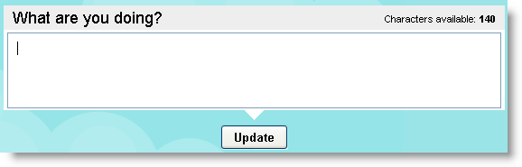

# Networks

## Twitter explorations {#twitter-explorations}

_Date posted: 25 July 2007_

[Twitter](http://twitter.com/) is another one of those viral phenomena in the internet-world. My colleague, [Karyn](http://karynromeis.blogspot.com/), has been encouraging me to try it out. So here are my initial reactions (and they're **not** favourable):

### What is Twitter? {#what-is-twitter}

When you get a Twitter account you're presented with a box where you have 140 characters in which to say what you're doing now.Twitter: What are you doing now?You can also add entries by phone or via a small number of instant messenger clients (not Skype or Microsoft IM unfortunately). You can choose whether you want your entries to be open to the world, or just to people you allow to see them. You can "follow" other people's entries. This means that they appear in your personal "timeline" - or list of entries. They can also be sent to your mobile phone as a text message. Similarly, other people can choose to follow you and your entries.

### What is Twitter for? {#what-is-twitter-for}

The main reason people seem to use Twitter is to increase their sense of connectedness to their network. [Will Richardson](http://weblogg-ed.com/2007/my-harry-potter-moments/) has showed how he used it to rapidly get feedback from his followers (that sounds so cultish, but it's the term Twitter uses!)

### What do I think? {#what-do-i-think}

I've only had 24 hours exposure to Twitter, but already I'm sorely tempted to delete my account. My mobile is full of text messages from one half of a conversation - most of which I'm not interested in anyway. Like a commenter on one of [Stephen Downes posts](http://www.downes.ca/cgi-bin/page.cgi?post=40924), I would ask whether people really want to be that connected? If I could guarantee that the people I follow will always write stuff that is useful to me then perhaps I'll reconsider my opinion. Until then, I think I'll stick with blogs - where at least, most of the time, people are writing interesting stuff. I just haven't got the time to maintain Twitter connections as well. If you want to see an even more considered response, as to why Twitter and the like prevent us from doing, learning, creating, and becoming experts, see [Kathy Sierra's post](http://headrush.typepad.com/creating_passionate_users/2006/12/httpwww37signal.html).

> ### Reminder {#reminder}
> 
> Please don't forget my [research survey](http://www.learningconversations.co.uk/main/index.php/mark/2007/07/21/dissertation_survey). So far I've had nine responses (thanks guys!) - although only four OPML files. I would encourage you to take part, as I'm hoping this may have some influence on how large scale professional development programmes are designed in the future. If you have taken part, please consider putting a link to the survey in a blog post or on a mailing list you are part of. Many thanks

## Ten tips for choosing & using social software {#ten-tips-for-choosing-using-social-software}

_Date posted: 13 November 2009_

My role often tends to be that of interpreter - helping IT people understand HR/Learning specialists and vice versa. This often means I'm involved in discussions about choosing and using software, particularly social software, often known as [web 2.0](http://en.wikipedia.org/wiki/Web_2.0). HR and Learning & Development see web 2.0 tools in use around the world, connecting people and ideas, and want to make that happen inside their organisation. The IT team see risks, loss of intellectual property and bandwidth hogging. Gross generalisations, I know. But they'll do for now. So, here are my top 10 tips for choosing and using software that will help both groups - and their senior managers - achieve their goals.

1.  Know your audience. Will they readily adopt social software? Are they already active on Facebook/Myspace/Bebo? Do they do social bookmarking with Diigo or Del.icio.us? Are they consumers or producers of information? Do they Twitter? Do they have blogs? Would they know a mashup from their RSS? What can you offer inside the organisation that they can't get outside it?
2.  Find the people that are actively involved in these networks to put together a web 2.0 policy for your organisation. Most corporate policies will be similar. [Tony Karrer's collection](http://elearningtech.blogspot.com/2008/05/corporate-policies-on-web-20.html) would be a good place to start. Even the [US Navy has a web 2.0 policy](http://www.doncio.navy.mil/PolicyView.aspx?ID=789).
3.  You will never compete with Facebook, Youtube, Twitter, Diigo, Ning etc. Don't even bother. Instead, get them working for you. Sell the benefits of participation. Not just those to the organisation, but those to the individual. Give permission - but, whatever you do, don't make them mandatory!
4.  Learn the capabilities of the free tools like Ning, Wikispaces and Google docs. They are more secure & private than many people realise.
5.  Discover for yourself the benefits of working outside of the [porous pyramid](http://www.jarche.com/2009/02/the-leaking-pyramid/). Join a group on [Ning](http://www.ning.com/) that is in your area of interest. [Search for blogs about your specialism](http://blogsearch.google.co.uk/) and collect them using an [RSS reader](http://www.google.com/reader). Perhaps even start your own [learning log](http://edubuzz.org/blogs/donsblog/about/).
6.  Have a NetSafe campaign inside the organisation - focussing on the implications of not keeping your blog / facebook entries / Flickr photos under control. Not just organisational implications, but personal ones.
7.  Start small. Stay under the radar for as long as possible. Let usage grow organically - virally even. A big bang launch will often just lead to unsustainable expectations, and long term negativity.
8.  Collaborative tools, such as wikis and forums need a common factor - a reason for being there, and a reason to contribute. Learn from those that are successful: [Wikipedia](http://www.wikipedia.com/), [Pfizerpedia](http://www.slideshare.net/bengardner135/meet-jessica), [Manager-Tools](http://www.manager-tools.com/), [Moodle.org](http://moodle.org/). Consider what makes them so special, amongst the many thousands of "failed" collaborative networks & forums. [Understand](http://www.wikipatterns.com/display/wikipatterns/Grassroots+is+best) what helps and hinders adoption. Creating a space for networking is fine, but how will you stimulate people to actually **do** that networking. Learn from conferences - they don't just land people in a room and let them get on with it. They provide stimuli of one sort or another.
9.  Consider how important the data in the social networks is to your people, and to your organisation. This blog is hosted by me, at my expense, because it's my data, and I want it under my control, not my employers. That's why I also don't host it on a free service - however good it might be. Free services are great if the risk to the business is minimal if the service stops. If that risk is great, then think about spending some money, perhaps even bringing it in-house.
10.  If you are looking to source real software, and spend real money, then start by looking at some of the open source tools like [Elgg](http://elgg.org/) - social network/blog/CPD portfolio, [b2evolution](http://b2evolution.net/) - multi-user blogging, [Scuttle](http://sourceforge.net/projects/scuttle/) - social bookmarking, [Gregarius](http://gregarius.net/) - RSS aggregator, [Dim Dim](http://www.dimdim.com/) - virtual meetings.

Three final points - just to wrap up...

*   Whatever you do, get your IT team on board, so they're aware of what you're doing and understand what you're trying to achieve.
*   Always think about it from your user's perspective. On the web, if it's too hard, people will lose interest and go to something else.
*   Don't be afraid to get help. The technology's the easy bit. It's making it work for you that's far, far harder.

I leave you with this short presentation, from the Slideshare presentation-sharing site, on web 2.0 in the Enterprise:[meet Jessica](http://www.slideshare.net/bengardner135/meet-jessica?type=powerpoint)

**Illegal HTML tag removed :** <param name="movie" value="http://static.slideshare.net/swf/ssplayer2.swf?doc=meet-jessica-1211211816442601-9&amp;stripped_title=meet-jessica"><param name="allowFullScreen" value="true"><param name="allowScriptAccess" value="always"><embed src="http://static.slideshare.net/swf/ssplayer2.swf?doc=meet-jessica-1211211816442601-9&amp;stripped_title=meet-jessica" type="application/x-shockwave-flash" allowscriptaccess="always" allowfullscreen="true" width="425" height="355">

View more [presentations](http://www.slideshare.net/) from [bengardner135](http://www.slideshare.net/bengardner135). (tags: [enterprise_2.0](http://slideshare.net/tag/enterprise_2-0) [meet](http://slideshare.net/tag/meet))

## The demise of global conversation {#the-demise-of-global-conversation}

_Date posted: 7 January 2011_

Reading Ewan Macintosh's recent post about [time zones killing real global thinking](http://edu.blogs.com/edublogs/2010/11/the-real-digital-divide-time-zones-kill-truly-global-thinking.html), I realised why some of my posts seem to "take off", while others die quietly. (And, no, I don't think all my posts are equal in quality. It's just that some of the ones I carefully crafted haven't seemed to have the readership I would have expected / hoped for.) I think Ewan's right when he says:

> Twitter has, for most folk, become their aggregator of choice. No longer do blog posts have a half-life of 24 hours, happily resting in your Google Reader until you launch it in the morning (your morning). Instead, your blog post has to hit a sweet spot where the maximum number of connectors and spreaders are awake, at their machine and ready to press "Retweet". That means hitting "Publish" at a time convenient to the mass of educators on the East Coast US, with a half-life of minutes before it is lost in the stream of other thoughts, resources and locker-room banter about baseball. The conversations have also disappeared from most of the blogs that I, at least, read from outside the US and Canada. They're maybe happening on Twitter, but are now dislocated from their origins, impossible to trace back, and even more impregnable to those coming in 24 hours late.

When you use Twitter, there's this constant nagging feeling that you're missing something important. And it's true. Unlike an RSS reader, which stores stuff until I'm ready to read it, Twitter posts will last a very short time. Where are we going with our conversations? Do we want fast food, and immediate gratification? Or are we going to take time to really think and really communicate?

## Using Yammer {#using-yammer}

_Date posted: 24 February 2011_

#yam [Yammer](http://www.yammer.com/) is a "real-time communication platform for companies, groups and organizations." It's a bit like having Twitter, but only for your company. But only a bit. In fact it's far better than Twitter in a lot of ways. Here are some of the key features that I think are important:

*   Messages can be any length
*   Messages can have files attached
*   Conversations are threaded!
*   You can create groups within your organisation's Yammer space
*   You can choose how you want to be notified of new things - whether by email, text (SMS) or not at all
*   You can auto-post from Twitter using the #yam [hashtag](http://help.twitter.com/forums/10711/entries/49309)
*   You can link posts using #tags
*   You can reply via email

The difference between a forum tool and a social communications tool is that forums are centred on the conversation, whereas social tools are centred on the individual. To keep in touch with what's going on on a forum you need to subscribe to the whole forum, or a sub-section of it. That's fine when conversations neatly split up into topics. The [Manager-Tools forum](http://www.manager-tools.com/forums) is an excellent example. Where a social communications tool, like Yammer, wins out, is when you want to stay in touch with the all the conversations that your particular colleagues are having. Yes, some of them will be irrelevant, but that's just like being in the office. For a distributed team, social tools can be invaluable for keeping your finger on the pulse. But what about email? In my view, email should only be used when one or more of the following conditions are met:

1.  The message should only go to a tightly defined set of people
2.  You want to be sure the recipient will receive the message
3.  You are not worried about keeping a centralised audit trail

So, enough about email. Are there any downsides to using Yammer?

### When Yammer doesn't work {#when-yammer-doesn-t-work}

It's not Yammer's fault when it doesn't work. And most of the time it's not even a technical problem (although Yammer does rely on everyone in the organisation having the same email domain). The main reason Yammer doesn't live up to expectations is cultural.

*   We're not used to sharing our thoughts online, as we think them
*   Some of the team don't work remotely, so there's no immediate benefit to sharing their ideas online
*   There are concerns about privacy or security

What are the best ways then of making sure that Yammer lives up to its promises.

### Making the most of Yammer {#making-the-most-of-yammer}

When used well, Yammer should make your teams more connected and productive. But how can we encourage its use:

1.  Use it yourself. Gradually start to push out notices and ideas via Yammer instead of through email alone. Get people used to seeing the Yammer name. At first it will feel like you're talking into a vacuum. Over time, with encouragement, others will join.
2.  Auto-publish from your blog or Facebook via the #yam Twitter hashtag.
3.  If you're worried about privacy, create a Private Group. If you're worried about Yammer and privacy in general, look at their [Privacy Policy](https://www.yammer.com/company/privacy). It should allay your fears.
4.  Spread the word. Invite people. Add your Yammer profile URL to your email signature.

Being the first in Yammer is a bit like being the first person in your town with a telephone. But get others involved and it'll be a lot more useful. The one thing to remember is that (like Twitter or a blog), you can never guarantee whether people have received your message. It's a pull medium, like television or radio. Your followers can always choose to unfollow. So, keep your posts to the point and useful to your colleagues.

## Yammer: Best practice guide #yam {#yammer-best-practice-guide-yam}

_Date posted: 23 March 2011_

> #### Comment::Comment
> 
> This is not really specific to Yammer - it could apply to any online social network.

You walk into a conference room. It's your first time at this particular conference and there's no welcome pack. You can see quite a few people standing around drinking coffee and eating small pastries. But no-one's talking to each other. You have three options:

1.  Turn around and walk out.
2.  Find someone you know and begin a conversation about one of the conference themes.
3.  Introduce yourself to someone you don't know and look for areas of common interest.

Yammer can sometimes feel like that conference room. For many people it's a strange new environment. There are no clear rules on how to behave or what to do. We know the value of networking, but doing that online can be daunting at times. So, here are some simple guidelines that may help: (NB. In Yammer, as in Twitter, when you "follow" someone, they become part of your personal network and anything they post will appear in your message stream)

1.  Introduce yourself via your profile. This is the way people will find you, or find out more about you. If you don't write a little about who you are and what you do, then it's unlikely that anyone will link to you unless they already know you.
2.  Find people you already know and follow them
3.  Add yourself to the organisation chart, and add those people you work with, or for, or those who work for you. It's the quickest way of building the network.
4.  If someone you follow posts something, consider replying. Networks are about two way conversations. As soon as a network becomes reliant on a few people pushing out ideas then that network becomes very vulnerable. Strong networks have multiple two-way connections.
5.  Once a week or so, consider starting a conversation. Pose a question. Share a link to something useful. Post a document. Think out loud. It doesn't have to be serious. It could even be controversial. As time goes on, the network will become a searchable repository of organisational knowledge.
6.  Look out for people from other parts of the organisation with similar interests, and follow them. Some people are very good at linking across different areas. If you follow them, then you're more likely to make your own connections.
7.  If you invite someone to Yammer, when they join make sure you welcome them and introduce them to the network. That way the people who follow you will become aware of this new person, and may be more inclined to follow them.
8.  If your organisation has a social media policy, make sure you're aware of it. It will protect you and the organisation. If it doesn't, then follow these simple rules:

*   Remember that anything you write down may potentially become public.
*   Remember that the other names in the network are real people, with real feelings.
*   Text is a great communication medium, but it doesn't convey emotion easily. When you're writing, be aware of how the words may be received. If necessary, use emoticons (like ;-) for example). But don't overdo it.
*   If you only want to communicate with a small, defined group of people, then use email. If you're having a general conversation about something, use Yammer.
*   If you want to keep your conversation inside Yammer, but private to a particular set of people, then consider creating a private group.

## Twitter as your main learning tool? I still don't get it {#twitter-as-your-main-learning-tool-i-still-don-t-get-it}

_Date posted: 11 August 2011_

For two years now, Jane Hart's collation of the [Top 100 Tools for Learning](http://c4lpt.co.uk/top-tools/top-100-tools-for-learning-2011/) has had Twitter in the number 1 spot.  And any number of "learning technology" people will tell you it's their most important tool.

Perhaps I'm missing something, but I just don't get it.

Twitter is a micro-sharing website - which means I can share a statement containing a maximum of 140 characters. That statement can contain links to other sites, plain words, links to other people (known as @mentions) and links to topics (known as hash tags or #tags).

Topics are created organically. A group of people agrees to use a particular #tag and then make sure each of their posts contain that tag.

Users can "follow" other people and see everything they're posting, or they can follow particular #tags. They can use either the Twitter website to do this, or any number of desktop or mobile applications - many of which allow you to be quite sophisticated in how you organise what you follow. (eg. [Tweetdeck](http://www.tweetdeck.com/)).

Twitter users have developed a number of abbreviations, which have now become adopted into the way the system works. For example, RT means ReTweet - ie. you are taking someone's post and pushing it out to the people that follow you.

The two characteristics of Twitter are:

1.  Posts can only be 140 characters long
2.  Posts appear as a stream. If you're not watching at the time a post appears, you'll probably miss it unless it gets retweeted later.

To my mind, Twitter is great for those quick "around the watercooler" conversations. Those ones that happen by chance, when you're in the same time and place as someone else (although with Twitter it relies on one person initially posting something that _might_ be of interest to their followers - they've got no idea of who might be listening at the time - so it's a slightly different situation to a face-to-face conversation).

It's also great for pre-planned conversations, that are fixed to a particular time, and usually led by someone who asks a short series of questions. These questions often stimulate further discussion.

As a learning tool, Twitter does have some uses. But it has some serious disadvantages too:

*   conversations can get very frustrating due to the 140 character limit. Many's the time when I've given up on a debate just because I couldn't say what I needed to in the space available.
*   it's a synchronous tool. If I'm not on Twitter at the right time I will miss what's being said. This has the side-effect of making Twitter (like Facebook) a highly addictive activity.
*   finding a Tweet (a Twitter post) at a later date is nigh on impossible. Google doesn't help - because Tweets are so ephemeral, and no-one links to them, they are rarely, if ever, picked up by the Google search algorithm.

### The Alternative? {#the-alternative}

I learn from the people around me, whether in the office, or from my wider network around the world. They are my personal subject matter experts. It's important to me that I keep up-to-date with thinking in my field (whatever that might be today!)

But I don't have the time or inclination to keep an eye out on Twitter for posts from each particular person. And, with each post being so short, they don't usually contain enough meat for me to get a real idea for what that person is trying to say.

So, my professional network takes two forms:

1.  People who think through what they're trying to say and present those thoughts through a piece of work that's taken some effort to produce. It might be a few paragraphs in a blog, or a video, or an infographic. The key thing is that those works sit in my [RSS Reader](http://en.wikipedia.org/wiki/RSS) until such a time as I'm ready to use them. At which point I can mark them as read, tag them for filing, make notes on them, or send them to an email address.
2.  People who I'm connected with on [LinkedIn](http://www.linkedin.com/). Then, if I need to find someone to answer a question, I've usually got a very good idea of who is the best person. Unlike Twitter, which gives you very little space to tell anything about who you are.

Now, there may be people that have got to this article through the auto-tweet that my blog makes. That's great. I'm really pleased you happened to be using Twitter at the same time as the auto-tweet came through. But, if you were away from Twitter and didn't have any other means of being notified about the article, then you would have missed it.

When I started blogging, in pre-Twitter days, there wasn't a place to quickly share odd links to stuff, so I put them on my blog. Gradually though, these were replaced by longer articles like this one - far more useful to me (as they help me to crystallise my own thinking), and, I hope, far more useful to the few people that followed the blog.

With the wholesale move of learning professionals to Twitter, I think we've lost out a lot of the practice of learning - which is about research, analysis, synthesis and depth of conversation - stuff that you just can't do in 140 characters.

I'm still part of the froth and bubble that is Twitter - it provides a useful insight into what people are thinking about at that particular moment in time, and is an easy place to share links to things that might be of interest to others. But to name it my number one learning tool? No. I don't think so.

## Twitter: do's and don'ts {#twitter-do-s-and-don-ts}

_Date posted: 24 April 2012_

It took me a while to understand Twitter. [I spent a long time taking the view that it was an addictive waste of time and pretty useless for in-depth conversations.](http://www.learningconversations.co.uk/main/index.php/2010/02/26/coping-with-twitter?blog=5) I realise now that I hadn't grasped when Twitter should and shouldn't be used, and how to get the best out of it. The following two lists are based on my experiences. I'd love to hear from others too.

### Do {#do}

*   Do treat Twitter like your work kitchen, water cooler or staff room. You wouldn't spend all day there, and you wouldn't expect to be aware of every conversation taking place while you weren't there.
*   Do dip in every now and again. Have a quick look at what people are talking about.
*   Do consider replying to someone if they have said something useful, interesting or stimulating. If there's nothing there of interest to you, then post about something that you've discovered, thought about or found infuriating. It might start a conversation.
*   Do make sure your Twitter profile says something about who you are and what you might tweet about, so people know why they might follow you.
*   Do follow people you find interesting. It's the equivalent of having people at work that you enjoy hanging out with in the staff room.
*   Do add a picture of yourself to your profile. It gives your Tweets a human face. This is true even if you're Tweeting as part of work.
*   Do take a break completely from Twitter for a few days. It'll do you good. Real conversations and thinking need more than 140 characters.

### Don't {#don-t}

*   Don't be afraid to dip out of a conversation. If someone wants to talk to you directly, they'll mention you in a post and you'll be able to reply later.
*   Don't tell us everything that's happening in your life. It gets a little boring.
*   Don't be afraid to unfollow people if what they are saying gets boring or irrelevant to you at the moment. It's not personal...
*   Don't just post links to your company website. I'm sure you're more interesting than that.
*   Don't try to read over every conversation that's happened in the past 24 hours. Just focus on the stuff happening now.
*   Don't use Twitter to replace reading blogs, journals and newspapers regularly. It's where the deep thinking is taking place. You do have an RSS reader don't you?

## Tips for a social organisation {#tips-for-a-social-organisation}

_Date posted: 13 July 2012_

With more organisations beginning to adopt social media as part of their daily work practices, it's important to pick up on some of the lessons learned from social media use out in the "real world"...

### Have a human face {#have-a-human-face}

When you're working in a virtual organisation, where face-to-face contact is rare, it's really important to have a photo on your profile. We humans react to faces from birth. Without an image of the person to hang a conversation on, all you have is words, and sometimes voice. See: [5 elements of a successful social media profile picture](http://topdogsocialmedia.com/successful-social-media-profile-picture/)

### Fill in your profile {#fill-in-your-profile}

Social media is often not actually that social. When you meet people face-to-face, a lot of the time is spent exploring points of commonality: where do you live, which school/university did you go to, who have you worked for, did you read such and such. It's these little things that help to build a lasting working relationship. Online, there's rarely the time for such chit chat. So we have to pre-empt it by giving out information up front. Out in the real world, I try to have just one or two places where my profile (the things I want people to know about me) is kept up to date. At the moment, that's primarily LinkedIn. Every other profile I fill in just links back to that. If you don't have a public profile yet, it's still important to have one within your work social media system. Choose a place you can link to easily, and put in as much detail as you can to help people gain a picture of who you are.

### Narrate your work {#narrate-your-work}

Many social media systems contain an ongoing status update page, where everything that's done in the system is exposed to the rest of the community. Usually you can filter this down to just the projects or people you're interested in. But that only covers the changes or updates the systems picks up automatically. It won't pick up the things that you're thinking about, or trying out. All this is important too. As Andrew McAfee says:

> Talk both about work in progress (the projects you're in the middle of, how they're coming, what you're learning, and so on), and finished goods (the projects, reports, presentations, etc. you've executed). This lets others discover what you know and what you're good at. It also makes you easier to find, and so increases the chances you can be a helpful colleague to someone. Finally, it builds your personal reputation and 'brand.' [http://blogs.hbr.org/hbr/mcafee/2010/09/dos-and-donts-for-your-works-s.html](http://blogs.hbr.org/hbr/mcafee/2010/09/dos-and-donts-for-your-works-s.html)

See: [Narrate your work](http://scripting.com/stories/2009/08/09/narrateYourWork.html)

### Make comments and links {#make-comments-and-links}

Networks die when there are no connections being made. As new people enter the organisation, or new pieces of content get added, pull them into the network by linking to them and adding comments to the content. A strong network is one where links are constantly being made and refreshed. See [George Siemen's seminal article on Connectivism](http://www.elearnspace.org/Articles/connectivism.htm)

### Ask for help {#ask-for-help}

It's OK not to know everything. In fact it's impossible to know everything. By asking for help you are giving yourself a learning opportunity, and also giving other people the opportunity to demonstrate their knowledge and skills in a public place. These days, giving away your knowledge is one of the best ways of ensuring your place in the network (and hopefully your future in the organisation!)

### Note {#note}

This article started off being all my own work, but, on finding Andrew McAfee's Harvard Business Review article, it turns out that I'm using many of his ideas! So, if you want more on this, go to the source: [http://blogs.hbr.org/hbr/mcafee/2010/09/dos-and-donts-for-your-works-s.html](http://blogs.hbr.org/hbr/mcafee/2010/09/dos-and-donts-for-your-works-s.html)
