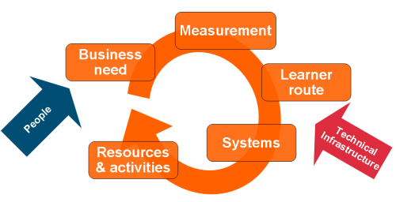

# Learning Design

## Things to consider when designing learning programmes {#things-to-consider-when-designing-learning-programmes}

_Date posted: 28 November 2005_

The following came from a group brainstorm at work and has since been severely pruned by me. We were looking at the process by which a learning programme to meet a specific learning need might be designed. Normally we tend to look immediately at the resources we need. However, until learning designers (and clients) understand the new, online world of learning as well as the old, offline world, we will always need to take them through a couple of stages beforehand: _Consider the context:_ Cultural: What is the CPD culture in your LA? What do people respond to well? What works and is effective? Infrastructure: What is in place that can be used to support CPD? eg. Network meetings, teacher centre, internet-based communication and collaboration tools. What access do the learners have to this infrastructure? What resources already exist? Management: Is school management supportive of CPD? How is CPD funded? How is time allocated? What cultural, infrastructure and management constraints are you working within? _Consider the activities your learners might do:_ When designing your learning programme it's important to take into account the theories that attempt to model how learning works: behaviourism, cognitivism, constructivism, connectivism et al. The activities that your learners will do will be influenced strongly by the ways you believe people learn, and also by the context in which the learning is to take place (see above). Some example activities:

|   | Online | Not online |
| --- | --- | --- |
| Individual | Find answers to questions Read Post messages to individuals Post messages to groups Ask questions Post messages to the world Be tested Play games Watch video and multimedia / TV Listen to Radio / audio interview/discussion Talk to others | Write a journal Write an article Write a report Write a Journal Write an article Write a report Listen to a Podcasts on mp3 player Shadow another person Read Be tested Build something Watch a demonstration or something being modelled Watch TV Listen to the radio Find answers to questions |
| Group | Participate in online discussion Teleconference Email Chat Write collaboratively Create media Play games | Thought showers Colleagues coaching Training sessions Presentations Conferences / video / telephone conferences Create media Participate in discussion Listen to Lecture Practical experiments Games Role play Drama activity Practice |

_Consider the resources you may need to support those activities:_ The activities you choose will need resourcing, maybe with personnel, with an environment in which they are to take place, with media, or with design tools with which to create or aggregate new media. Your choice will be influenced by the context in which the learning is to take place, particularly the existing resources already available to you. Some example resources:

|   | Online | Not online |
| --- | --- | --- |
| Personnel | Forum facilitator (e-moderator) Content manager Administrator Mentor IT support Friends Learning designer (instructional design) Teacher Chat group Network Expert Editor Learners | Administrator Teacher Facilitator Coach Mentor Trainer Teaching assistant Parent / siblings Friends LEA advisor Department Learners Editor |
| Media | PDF Hypertext mp3 (audio) mp4 (video) Images / graphics Diary Sequential learning module Presentation (webcast) Animation Blog Game space email Quizzes web forms | Book Magazine Newsletter DVD (video) DVD Rom Radio TV Poster CD-Rom Worksheet Powerpoint presentation Letters Phone calls Books Course materials Print Interactive CD/DVD rom Exam papers |
| Environment | Wiki Blog Podcast Learning Management System Forum Chat room Video-conferencing Audio-conferencing WWW Intranet LAN Network Moodle e-classroom computer lab / office / home | Meeting room Classroom Coffee bar Pub Park Car park Training room Museum Bedroom Library Conference Group Hobbies Life |
| Design tools | Word Powerpoint HTML editor Audio recorder / editor Video editing Wiki Blog RSS aggregator (eg. SuperGlu) | Desktop Publishing Word Powerpoint Flash Windows PhotoStory Windows MovieMaker |

By no means is this a definitive list. It's very much a work in progress.

## Come on in, the water's lovely {#come-on-in-the-water-s-lovely}

_Date posted: 31 May 2006_

There's been _lots_ of _talk_ over the past couple of years about the revolution afoot in the educational world. A revolution that will mean learners and teachers working in a new relationship, with a new, more appropriate curriculum; developing skills that will help them become better learners, who are more able to deal with the rapidly changing world (and job market) around them, and using communications technologies to expand horizons beyond the classroom wall. Some places have taken this at a high level and run with it (eg. [Tasmania's Essential Learning Framework](http://www.education.tas.gov.au/school/parents/teaching/els)), but most countries, local authorities, school districts, corporate learning & development departments etc seem reluctant to embrace the inevitable disruption and political backlash that would happen. And it is disruptive... The traditional, top-down view of learning, where a person is given a teaching "position", ...  ... is changed, through the effective use of communications technology, to an apprenticeship model, where the mature learner chooses the teacher:  There is a total shift in the balance of power. But it depends totally on learners being mature enough to take advantage of it, and teachers being mature enough to accept that their position is fixed only while they are useful to the learners. For people involved in leading & administering learning it is very easy to drop back into the comfort zone of programmes, courses, tests etc - what some people call the ["industrial model"](http://www.jarche.com/node/677) of learning. Yet that model just will not survive in the current, rapidly changing world, where knowledge is out-of-date faster than you can forget it.

> Learning can no longer be seen as an activity separate from other information and knowledge-based activities. Learning, knowledge management, content management, information management, and other knowledge capital systems must function coherently as a whole. [George Siemens: Google Whitepaper (pdf)](http://www.elearnspace.org/Articles/google_whitepaper.pdf)

What is needed, at all levels of education and learning, is an emphasis on developing:

*   mature learners, who know how to learn, how to manage information, who to ask, how to find out, and what questions to ask.
*   mature teachers, who know how to learn, but also know how to coach and mentor.
*   systems and environments that can be used to support _learners_ in their learning process. It's not about creating "programmes", it's about creating "environments" within which a "learning ecology" can flourish.

(Credits to [Jay Cross](http://internettime.com/wordpress2/?p=560#more-560), and [George Siemens](http://www.elearnspace.org/Articles/learning_communities.htm) for these ideas.) How this is worked out will depend on the situation people are working in, but the critical thing, whenever you are talking about learning ecologies, is they are based around networks of individuals, and their connections. Starting with that premise will give a good foundation on which to build.

## Blended learning - back to basics {#blended-learning-back-to-basics}

_Date posted: 14 July 2008_

[Clive Shepherd](http://clive-shepherd.blogspot.com/2008/07/is-everything-blend.html) and I have been having a spirited discussion about the concept (or not) of "blended learning". I think my last comment got lost in the Blogger system, and I wanted to get some ideas down here anyway... Basically, Clive has put forward a definition of blended learning that describes it as a situation that uses a variety of media in a variety of social contexts (ie. group size). To my mind this covers pretty much every learning situation, so I can't see the need for a separate definition of "blended" learning (which should actually be blended _teaching_ anyway, but that's another argument). I gave an example from a typical (pre-internet) primary/secondary classroom: - self-study (eg. children working through worksheets, reading books etc); - one-to-one (eg. children reading individually with me) - small group (eg. children working together on a science experiment) - larger community (eg. children presenting ideas in school assembly) You could equally use a typical face-to-face training session which includes reading, small group discussion, presentation to the wider group, viewing of materials on a screen etc. Clive responded with the comment:

> "... I must admit that my primary perspective on this issue is work-based learning, where this scenario would be extremely rare."

If that is the case then we are in a very sad situation, where, by trying to constantly find shortcuts to learning we have thrown out everything that we know about how people learn. I think it starts at University, where the lecture seems to be the dominant teaching form (regardless of its effectiveness) and we then assume that all adults learn through single medium, single context situations. So, workplace learning professionals out there, do you think we need to go back to school to learn how to teach again?

## Be HypeAware {#be-hypeaware}

_Date posted: 26 January 2009_

As a learning professional I get a lot of material written by companies that want me to buy or recommend their products. I wish, though, there was a little bit more reality in the descriptions and a lot less hype and [FUD](http://en.wikipedia.org/wiki/Fear,_uncertainty_and_doubt). As an example, here's an excerpt from a recent [Learning Magazine](http://www.learnevents.com/learning-magazine.php). (NB. Other sources are just as guilty!)

> [Major elearning company] unveiled a global survey that shows roughly seven out of 10 workers have been asked to accomplish tasks without receiving proper training beforehand. Within IT ... the problem is even more pronounced.

The "problem"?! Why is it a problem? It's only a problem if you believe that you have to fill people up with knowledge before they can do anything. Isn't that a rather old-fashioned view of what learning is all about? Do we train our children to walk before they are allowed to take their first steps? No! What we do is give them support and coaching in a safe environment - where failure is OK. To be honest, I quite relish being given a task I've never done before. It gives me something new to learn. Then we get onto the buzzwords like SCORM. It sounds great in theory, but is often worse than useless in practice. (See: SCORM Warning) And what about about all those articles that reference the pseudo-scientific concept of "Learning Styles"! For example, the VW case study which talked about some consultants that "found" that apprentices were enthused in the workshop and not in the classroom. They wrapped it in some learning style mumbo-jumbo and redesigned the classroom learning to include more hands-on stuff, more pictures and more reference to popular figures (eg. David Beckham). That's nothing to do with individual learning preferences. It's all about knowing your audience and the sorts of things that they respond to. The problem with the learning style approach is that it leads you, if you're not careful, into pigeonholing people, based on a questionnaire they filled in some time ago. In reality, individuals may have different ways of learning that depend on the context, on their emotional state, on the subject covered, on the time of day it is etc. Good teachers know that they need to vary how they approach things. How they do that will take into account all those factors. (Just compare how children respond on a Monday morning to a Friday afternoon!) It's not rocket science. (See: Heterodoxy: [Learning styles don't matter](http://www.doceo.co.uk/heterodoxy/styles.htm))

## Designing a large scale learning programme - 1 {#designing-a-large-scale-learning-programme-1}

_Date posted: 14 May 2009_

When it comes to designing a large-scale learning programme, the processes you work through are probably not much different to building something just for your team. The difference is that you will need to be much more explicit in your thinking, rather than relying on gut instinct. When I start out with a new learning programme I try to split my work into three core areas:

*   Learning architecture
*   Technology infrastructure
*   People (probably the most important)

Getting the learning architecture is important, but, if you get the technology or the people aspects wrong then nothing's going to make the learning work! Much of the thinking is iterative; as soon as you get one thing sorted you need to go back and work out its impact on the rest of the design. Throughout the process, the role of the Solutions Architect is to balance the needs of the organisation and the needs of the learner with the resources available (eg. systems, budgets, people). Just like in a real-world building project, getting the architect in early is essential. On large-scale projects there's no point giving the builder their instructions on what to build, and then bringing in an architect to make sure they do it properly. The architect is the link between your organisation's real (rather than perceived) needs and the solution to those needs.

### Learning architecture {#learning-architecture}

### Business need {#business-need}

Before you even start thinking about what the learning programme is going to look like you need to consider the problem that it is meant to solve. It might be that your client organisation is wanting to explore new approaches to a particular aspect of its work, where the outcome is uncertain. Or there may be a need to proove that the organisation has complied with particular legal or regulatory requirements. (I'll leave it for others to debate whether that means training is the only solution.) Perhaps the organisation needs to ensure that there is a consistent skill base across the whole workforce. Your client might have decided that people need a raised level of knowledge and understanding of what you do. Or perhaps there's a strategic need to change behaviours across the organisation. Whatever the business need, you must understand it. And you must get to the bottom of the reasons behind that business need. Alongside that you'll need to know very quickly what drives the organisation's culture. Without those two converging streams of understanding, you will find it extremely difficult to create a learning solution that matches the client's needs and expectations. There are two tools that really help in this process with clients. One is [Cathy Moore's action mapping presentation](http://blog.cathy-moore.com/2008/05/be-an-elearning-action-hero/). This, very clearly, shows the client the importance of focussing on what they want people to **do**, rather than know. The other tool I use considerably, especially in client workshops, is some sort of visual mapping tool. Options here include:

*   [MindManager](http://www.mindjet.com/) - a very powerful [mind mapping](http://en.wikipedia.org/wiki/Mind_map) tool that integrates well with MS Office.
*   [Freemind](http://freemind.sourceforge.net/wiki/index.php/Main_Page) - an open-source mind-mapping tool. Fast and simple to use.
*   [CmapTools](http://cmap.ihmc.us/conceptmap.html) - a free [concept-mapping](http://cmapskm.ihmc.us/servlet/SBReadResourceServlet?rid=1064009710027_1483270340_27090&partName=htmltext) tool

These tools are useful to both collect ideas together, and then to re-present those ideas back to the client as your understanding of what they are trying to achieve.

### Measurement {#measurement}

As an adjunct to understanding the business need, you will also need to understand your client's expectations of what they will measure. As soon as you put any part of a learning programme online, you run the risk of measuring things just because they are easy to measure, rather than because they are important. Online learning provide huge amounts of data about what learners are doing and when they're doing it. Much of that data might be useful as aggregated statistics (given a large enough population sample), but it tells you very little about the individual learner. The challenge is to find the things that you can measure that will give you meaningful information about whether you are achieving your business needs. Consider what it is you want to find out:

*   Learners' skill levels before and/or after the learning intervention?
*   How your learning intervention is perceived?
*   How many people took up your offer of the learning intervention, and to what extent
*   Whether your learning intervention made any difference to learners' behaviour?

You'll also need to consider whether the measurements are "high stakes". In other words, are other actions dependent on the results of the measurements.

## Training can not lead to learning without feedback {#training-can-not-lead-to-learning-without-feedback}

_Date posted: 5 September 2009_

[A while back](http://www.learningconversations.co.uk/main/index.php/2007/12/14/death_of_the_one_hit_wonder?blog=5), I wrote about the importance of dialogue and feedback to ensure effective change. Far too often I come across people asking for "learning modules" which are intended to change behaviours or develop skills or knowledge, yet many times are purely about providing information, hints, tips, guidance etc. So what is it that makes an information module into a _**learning**_ module? The secret ingredient is feedback. For simple changes that feedback could be given programmatically. ie. through the learning module itself. (Please note that I have not specified **online** - a learning module can be delivered through a book, a DVD, a podcast etc). Programmatic feedback is a means of allowing the learner to interact with the material and the material provides feedback on performance. The more complex the change required, the more complex the programming will need to become. This can lead to the sorts of Serious Games and simulations that are starting to make an impace now. There comes a point, though, when human interaction is essential to give feedback. For financial reasons this is usually minimised as much as possible. Yet that can be a short-sighted decision which means that all the work put into the module materials does not bear fruit. Human feedback can come from the learner's peer group (through action learning sets, or online forums), from a "tutor" (again using either face-to-face or online means), or from a manager (via coaching or one-to-ones). The most cost-effective of these ought to be the manager. They know the learner the best. They work with them on a daily basis, and they understand the changes needed, and the context within which the learner is working. That's the ideal. Many organisations, however, don't seem to work in that way, and the feedback process is either left out or handled by professional trainers who will only see the learner maybe once or twice. Only once have I worked on a project where management coaching, feedback and facilitation was a central part of ensuring the effectiveness of the learning module. It was expensive to implement; requiring some upskilling of the managers - but, by all measures, it was a great success. It achieved all its stated objectives (including leading to measurable improvements in the business), and left a workforce that was ready for further changes. If we don't build feedback into our training, then we may as well not bother if we want lasting change. [This post was stimulated by an advert for the Open University, which highlighted the yawning chasm between [their view of distance learning](http://www3.open.ac.uk/study/explained/what-will-it-be-like.shtml) and most workplace-learning initiatives.]

## Blended learning - a personal definition {#blended-learning-a-personal-definition}

_Date posted: 21 September 2009_

Blended learning means making full use of the available resources, environment and people to help learners learn. It may or may not include using computer-based systems. Any good teacher or tutor uses a blended approach to their teaching. Any learner who is engaged with their learning will use a blended approach to their learning. Examples include:

*   A management trainer using a mix of group activity, chalk & talk, and individual reflection
*   Someone learning how to use Excel, by using a mixture of trial & error, a reference book and the Excel help files.

It could be argued that all learning is blended, but some teaching is not blended. All good teaching is blended. Just because a learning programme is blended (ie. uses a mixture of approaches), it does not mean that the learning programme is going to work. The design of the interface between the different approaches is crucial, so that learners are never left wondering what they should do next. Providing a choice of approaches and materials is good for "advanced learners"; people who know how to use that choice effectively, who know how to learn. Many learners, particularly when starting out on a new area of learning, often need far more structure. In this case a linear, timeline driven mix of activities and resources can often be the best design.

## Are you a learning solutions architect? {#are-you-a-learning-solutions-architect}

_Date posted: 7 October 2009_

A Learning Solutions Architect works in a very similar way to a real-world buildings architect. They act as the central point for the design of a solution. They get to understand the client's needs and wants intimately. They know that their solution must fit into the existing infrastructure and surrounding landscape. They can explain complex ideas simply to the many interested parties - in their language. They have to be flexible and work within fixed budgets. So, how do you know if you're a learning solutions architect? Here are a few scenarios that I come across on a regular basis. Let me know if they ring bells with you. Do you ask your clients "Why?" more often than they might be comfortable with? Do you turn complex ideas into simple pictures? Do you act as an interpreter between IT and Learning & Development? Do you talk to IT about bandwidth, hosting, firewalls and browser compatibility? Do you talk to Learning & Development about the differences between behaviourist, cognitivist, constructivist and connectivist approaches to learning? Do you talk to the Programme team about where learning, and its associated systems, fit into the wider picture? Do you have a healthy appetite for learning about new tools, systems and ideas that might have a place in future designs?

## A corporate learning ecosystem {#a-corporate-learning-ecosystem}

_Date posted: 19 August 2010_

Some more thinking on the place of learning management systems within a corporate learning ecosystem. The slides below start from the point of view of the learner, and their motivations for learning. We **must** understand what will drive learners to our learning materials, courses, reference materials etc before we can begin to design systems and content.**[A corporate learning ecosystem](http://www.slideshare.net/berthelemy/a-corporate-learning-ecosystems)**

<iframe src="//www.slideshare.net/slideshow/embed_code/key/Kasg243r6WG5Xx" width="595" height="485" frameborder="0" marginwidth="0" marginheight="0" scrolling="no" style="border:1px solid #CCC; border-width:1px; margin-bottom:5px; max-width: 100%;" allowfullscreen> </iframe> 
 <strong> <a href="//www.slideshare.net/berthelemy/a-corporate-learning-ecosystems" title="A corporate learning ecosystem" target="_blank">A corporate learning ecosystem</a> </strong> from <strong><a href="//www.slideshare.net/berthelemy" target="_blank">Mark Berthelemy</a></strong> 

## Choices in learning design {#choices-in-learning-design}

_Date posted: 12 October 2010_

What follows is an update of a post I wrote back in 2005 about what to consider when designing learning programmes. As "Learning Designers", once we've asked the right questions at the outset of the project, we need to get down to the iterative process of coming up with a solution.

At the outset, a whole range of potential solutions are available to us. As we start to work through the constraints and the requirements, many of these possibilities will become less viable. Eventually we'll end up with a small number of possible solutions. I'm going to describe the filtering process in the way that I often approach it. Others may do things in a completely different order, but we'll all have to deal with the same issues.

### Context {#context}

#### Culture {#culture}

I'll need to understand the culture of the organisation I'm working with. Often that means some very difficult meetings where all I seem to ask is "Why?" If you don't dig into what makes the organisation tick, then you're missing a hugely important part of the jigsaw that is a successful learning programme.

Find out what drives people to perform well. How do they gain recognition, promotion, pay rises? What motivates them? Find out about the management culture? Do they use frequent coaching and one-to-one sessions about individual performance? Where does management focus its effort? On sales? On product development? On personal performance? On outputs?

Find out what really works as regards learning... If at all possible, don't just rely on the HR and L&D people to tell you. Try to talk to the managers, or even (heaven forbid!) the people who will be affected by the programme.

#### Infrastructure {#infrastructure}

What basic infrastructure is already available that can support learning? Is there an organisational IT network? Does it work at useable speeds? Are there times when it can't be used effectively? Is it just for storing files, or does it also have applications like a content management system, email, calendars, micro-blogging etc?

Can your potential learners break out of the network and use the internet? What restrictions are placed on their use of the internet?

Does the organisation use telephone conferencing? Does that include capabilities to host online meetings that use desktop sharing, presentations, video, chat etc?

What facilities are available for holding face-to-face meetings? What sizes of rooms are available?

#### Management {#management}

This comes down to time and money really. Will the managers be supportive of the learning programme? Will they allocate time for people to do it properly? Will they be prepared to provide feedback on the effectiveness of the programme? Who is paying for the learners to take part in the programme? Who has the money invested in it? Can you even find out who the managers are?

#### Learners {#learners}

We're always exhorted to know our "audience" before trying to teach them. Is there someone you can work with who knows the daily life of the people you're trying to teach? Can you plan in some time to work with them for a day or two?

Can you build up a picture of a "typical" learner or two? It's really useful to have these pen portrait [personas](http://en.wikipedia.org/wiki/Persona_(marketing)), as it then helps as model to test your ideas against. NB. I linked to the Personas (marketing) article on Wikipedia, as it's my belief that learning and marketing have similar objectives (to change behaviours).

### Objectives {#objectives}

All the time, while you're finding out about the culture of the organisation, you need to be thinking about the objectives of the programme. Ideally these will be measurable objectives - things that the organisation is trying to change through your programme.

Hopefully you've not yet got yourself into a position where you've already told the client what you're going to deliver...

### Activities {#activities}

Learning is about doing, about engaging with content and people. So that's where I start - by considering what activities I am going to ask my learners to do. It's a hangover from my teaching days - my planning sheets always had a space to record the activities the children (and I) would do at each stage in the lesson. Only then could I plan what resources I'd need to support those activities.

The activities that your learners will do will be influenced strongly by the ways you believe people learn, and also by the context in which the learning is to take place (see above). So, to do this, you'll need to have a reasonably good idea of the different theoretical models of learning (eg. [behaviourism](http://en.wikipedia.org/wiki/Behaviorism), [cognitivism](http://en.wikipedia.org/wiki/Cognitivism_(psychology)), [constructivism](http://en.wikipedia.org/wiki/Constructivism_(learning_theory)), [connectivism](http://en.wikipedia.org/wiki/Connectivism_(learning_theory))) and which one is the best fit for your situation.

### Resources {#resources}

The activities you choose will need resourcing, maybe with personnel, with an environment in which they are to take place, with media, or with design tools with which to create or aggregate new media. Your choice will be influenced by the context in which the learning is to take place, particularly the existing resources already available to you.

At this point you'll also need to look back at the context and constraints you're working under. From here on it becomes an iterative process to get to the best (not always the ideal) solution.

## # A model for continuing professional development {#a-model-for-continuing-professional-development}

_Date posted: 16 January 2011_

Over the past few years, I have gained enormously by listening to, and engaging with a number of communities of practice; within teaching, higher education and workplace training. Existing on the boundaries of these communities has allowed me to bring ideas from different sectors into whichever job I find myself doing. Whilst at the [Collaborate for Change](http://teachmeet.pbworks.com/w/page/32996820/Collabor8-4-Change-at-BETT-2011) event last week (also, see [Zoe Ross's review](http://www.zoeross.com/2011/01/14/c84c-more-please/)), I spent a fair bit of time talking with people about teacher professional development. But, actually, the ideas being generated apply equally to almost any other profession or community of practice.

### Motivation � the key {#motivation-the-key}

The key underlying factor for any successful professional development model is motivation. I spent a long time, whilst working as a teacher, expecting my school or local authority to provide whatever professional development it thought I needed. It was only when I moved to the corporate world, into an environment where responsibility for your actions (and your mistakes) was devolved as far down as possible, that I discovered the need (and the benefits) of taking responsibility for my own learning. That's a long process though, and depends very much on an enabling culture of both management and financial decision-making. Either that, or it depends on mavericks; people who take responsibility for themselves, simply because they know it's the best way to improve what they do. Alongside that bottom-up driven professional development, there need to be some external motivating factors that will help reluctant learners to take responsibility for their own development. These might include:

*   Recognition
*   Increased pay
*   Better chances of promotion

### A deepening framework {#a-deepening-framework}

I have had the chance to observe, and take part in, a number of professional development opportunities. Some have been incredibly useful, others less so. The list below comes from these experiences. As you move down the list, the depth of learning possible becomes greater. Basically, the more you put into an experience, the more you will get out of it.

1.  Watching a presentation, listening to a talk or lecture
2.  Taking an active part in a conversation where you have to argue a point, both online or offline. There are a number of models for this, such as [Fishbowl](http://en.wikipedia.org/wiki/Fishbowl_%28conversation%29), [Study Circles](http://en.wikipedia.org/wiki/Study_circle), [Action Learning Sets](http://en.wikipedia.org/wiki/Action_learning), and table top conversations (like we did at Collaborate for Change)
3.  Producing and sharing resources to support other professionals
4.  Reflecting on input that you have experienced
5.  Reflecting on that input in public, and responding to feedback

This is an extreme simplification of some much better thought out models, such as [Gilly Salmon's 5 stage model](http://www.atimod.com/e-moderating/5stage.shtml) (which was designed for online learning, but applies equally well to any context where the aim is to encourage deep professional development).

## What's in it for me? {#what-s-in-it-for-me}

_Date posted: 10 February 2011_

What's in it for me? That sounds so selfish! But it's how we prioritise. We do it every day - all the time. Whether it's a conscious decision or not; we always decide to do things on the basis of whether we think it's going to good for us or good for something/someone that we are linked to. That's why it is **so** important that we ensure the learning experiences we design are absolutely explicit about what learners will get out of it, and what's expected of them. Learning designers (and I include teachers in this group) like to work with objectives. It's what we've been trained to do. They set the boundaries and the reasons for designing a particular learning experience. We assume that learners will like objectives just as much as we do. So we copy them onto the board at the beginning of lessons, or put them in our course catalogues. How much does that really set the learners' expectations? Does that give them enough so they know (really know) what's in it for them? I've [mentioned the Manager Tools team before](http://www.learningconversations.co.uk/main/index.php/mark/2007/06/18/manager_tools_an_intriguing_business_mod). I was listening to their recent show about their forthcoming conference. I can't go - it's in Texas. But here's what I know about it already:

*   It's two days long
*   It's in September
*   Only 100 people will be able to attend
*   It will be an intensive two days
*   The last conference was a life-changing experience for many people (based on the comments on the forum)
*   The days will be very long (compared to the UK - where people expect to start around 10am and finish about 3:30pm)
*   There will be lots of opportunity to get all my questions answered by an expert in management
*   I know he's an expert from listening to the other shows, and seeing the answers to questions on the forum
*   The sessions will take the ideas already discussed on other shows, and help me to apply them in practice
*   I will be expected to practice the skills discussed
*   There will be lots of practice
*   There will be coaches sitting in on the practice sessions to help me develop
*   There will be breaks every hour
*   I will make lots of contacts
*   I will be able to follow up on the forum afterwards

So, at this point, I already know far more about this event and what I'll get out of it than any other formal learning experience I've had. I've not just got a list of objectives and speaker biographies. I know exactly what it's going to be like. I can make a proper decision whether to invest my time/money/effort in attending. If it was in the UK, I could certainly argue the business case for it now. [More details about the conference.](http://www.manager-tools.com/effective-management-conference/)

## Taking responsibility for learning {#taking-responsibility-for-learning}

_Date posted: 10 February 2011_

Post no. 2 in my further reflections on the [Learning & Skills group conference](http://www.learningconversations.co.uk/main/index.php/2009/06/09/learning-aamp-skills-group-conference-re?blog=5). Many organisations find that motivating their employees to take responsibility for their own learning is a limiting factor. Motivation is the internal condition that activates behavior and gives it direction; energizes and directs goal-oriented behavior. ([Wikipedia 30/07/09](http://en.wikipedia.org/wiki/Motivation)) It comes in two forms; extrinsic and intrinsic.

> Intrinsic motivation is the internal desires to perform a particular task; people do certain activities because it gives them pleasure, develops a particular skill, or it�s morally the right thing to do. Extrinsic motivation is the factors external to the individual and unrelated to the task they are performing. Examples include money, good grades, and other rewards. ([Dr. Ryan on motivation](http://www.fiu.edu/~cryan/motivation/intrinsic.htm))

Without motivated learners we (learning designers, trainers, tutors, authors etc) may as well just give up. Nothing we could do would make any difference at all. Ideally, we would move from learners being reliant on extrinsic motivating factors to intrinsic factors. That's the point at which they have then taken responsibility for their own learning. A question I always ask at the outset of any learning design project is: "Why are learners going to engage with these materials / activities?" Too often, the answer comes back: "Because we'll tell them to." I'm sorry. That's not enough. All you'll get then is conscripts. People who don't really want to be there. If they do learn anything, or change their behaviour as a result then that will be a fluke. This is less true of face-to-face interactions as the facilitator/trainer can do more to engage the delegates when they arrive. With online learning, however, **the learner is in total control**. If they're not motivated in the first place, you've got an incredibly difficult job to engage them - when they can so easily just turn off at any time. At best, they might just click through your materials... So, how do we move individuals from being unmotivated to learn through to taking responsibility for their own learning? Based on [my experience of that particular journey](http://www.learningconversations.co.uk/main/index.php/2008/04/10/command-aamp-control-vs-learning-anarchy?blog=5), I would suggest the following ideas:

*   Be explicit about "What's in it for me?" whenever you're trying to promote anything new.
*   Take more of a [coaching attitude to management](http://www.learningconversations.co.uk/main/index.php/2007/10/10/coaching_aamp_me?blog=5), rather than providing all the answers.
*   Develop a culture of personal responsibility. Wider than just learning, this should include performance, finance and mistakes.
*   Allow mistakes to happen. But make sure all concerned learn from those mistakes. "What did you learn today?" should become a standard question in team meetings.
*   Provide access to resources and networks, and help people see how they can get the most out of them.

### Related posts: {#related-posts}

[Developing reflective practice](http://www.learningconversations.co.uk/main/index.php/2006/05/05/mark_berthelemy_weblog_my_hidden_agenda_?blog=5) [More bang for your buck](http://www.learningconversations.co.uk/main/index.php/2008/01/04/more_bang_for_your_buck?blog=5)

## Technology in the training room - no thanks! {#technology-in-the-training-room-no-thanks}

_Date posted: 9 June 2011_

There's a lot of talk in L&D teams these days about using mobile technology (usually tablets) in the training room. It's similar to the discussions schools had (or in most cases didn't have!) when the last government's Interactive WhiteBoard funding came in. In many cases, the talk is focussed on the glitz that technology brings. "It'll make us look modern... up-to-date." There's often very little discussion about the real place for technology in learning. The classroom is probably the worst place to put technology. You're wasting the valuable time where you've got a group of people in the same room. That time should be spent conversing, listening and discussing, not interacting with screens or with people outside of the room. Yes, there will be times when the facilitator (or one of the delegates) wants to demonstrate something, or show a video to help with a particular point. But that should be the exception. In general, I would argue that the ideal position is that all technology (apart from pens and paper) is left outside the classroom. And that includes Powerpoint! It means you focus on the people and the conversation in the room, rather than on what's happening outside. What this means is that, when there's content to be digested, reflections to be written up, or conversations to happen with people outside of the classroom, this should happen outside of the time allocated for the classroom. For example, let's take a workshop that's designed to "train" people how to do performance appraisals...

### Before the workshop: {#before-the-workshop}

Produce materials (audio, video, written, whatever) that will get people thinking about the process, and about the issues they'll need to address. Make it totally clear that the workshop will not be re-presenting those things.

### During the workshop: {#during-the-workshop}

Highlight the key issues, get people talking about the questions raised, and practice the bits that need practicing (eg. how to give feedback). Use a printed mind map or concept map if you need something to hang the discussion on.

### After the workshop: {#after-the-workshop}

Encourage delegates to reflect in a public space on what they've learnt. You could even make this a condition of getting an attendance certificate! Using this approach will make far better use of the time available, and be far more effective in terms of what delegates are able to do afterwards. It also means that your classroom sessions will become seen as a much more valuable part of what you're offering. Of course, this is an ideal situation, that depends on a whole host of cultural and organisational factors. In reality, there's probably still a place for technology in the classroom, for the moment anyway...

## Learning made easy? {#learning-made-easy}

_Date posted: 11 June 2011_

A while back I received a T-shirt as part of a promotion for a new IT training service. It's not a bad T-shirt at all; quite comfortable and easy to wear. But wearing it in public makes me feel rather uneasy, as the words on it run counter to what I believe is true:

It's just that learning - that process through which connections are made in the brain - isn't easy... It takes concentration, dedication, and, often, mistakes, over a period of time. If something is easy to learn, then that should raise questions about the value of that thing. I'm going on a course next week. The first for a long time. It's on the [PRINCE2� project management methodology](http://www.ogc.gov.uk/methods_prince_2.asp). Given what I've read of the pre-work, this is going to be a hard week. There's a lot to get my head around, to apply to my current practice, and to remember for an exam on Friday. But that's a good thing. It means that the Practitioner certificate I'm hoping to gain will mean something. It will have value. Similarly, the expectation is that what I learn on the course will add value to the work I do. If I was told that learning PRINCE2� methodologies was easy, then why would I go on a five day course? I'd look it up and muddle through (as I have done up to now!) But, because I want an in-depth understanding, so I can use PRINCE2� properly and appropriately, I'm going to make an effort. Learning isn't easy. Not for the learner.

## Building your ~~social~~, ~~mobile~~ learning ~~technology~~ strategy {#building-your-social-mobile-learning-technology-strategy}

_Date posted: 9 December 2011_

Lots of organisations are looking through their corporate boundaries and realising that the world outside is changing - and fast! Whereas fifteen years ago mobile phones were still quite new, now they are ubiquitous. Being constantly in touch and available has become the norm, so much so that people have to [announce that they are going "offline"](http://dougbelshaw.com/blog/2011/11/01/incoming-belshawblackops11/) The Internet has taken over from the High Street as the place where people shop and communicate. And now distance and national borders are really no barrier. Our networks of trusted suppliers and contacts are geographically dispersed; often to the extent that we don't even know where they are located. When I was a child, when I needed to find something out for school homework, I'd turn to our set of Everyman's Encyclopaedia or take a trip to our local library. My own children now have the collected knowledge of the world at their fingertips. The skills they need to interpret and use it are far more advanced than anything I had to do. Organisations that have direct contact with real people (ie. not business to business organisations) know that expectations have changed, and have had to change their sales, marketing and delivery processes to reflect them. These organisations tend to be the ones that have realised they also need to change the way they deal with people inside the corporate boundary. These changes are particularly pertinent to learning and development, which is the cross-over point between internal communications and operations. We have to constantly reassess how we are working to remain relevant. However, too many times, we simply pick up on the latest buzzword for the year and create a strategy to reflect it. So we end up with elearning strategies, social learning strategies and mobile learning strategies; all sitting separate to our core operation which continues delivering classroom-based training... I wonder how many organisations, if asked, would be able to describe their learning strategy? How many would be able to show how their Learning & Development teams directly make a difference to the ongoing success of the organisation? How many would be able to show, by reference to research (not psycho-babble and hype), how their approaches to learning will actually help people to learn? How many would even know what they meant by "learning" in their particular context? And why is that particular "learning" needed anyway? When I was working in schools, I came across many policy documents around homework, special educational needs, health and safety, report writing, learning styles ([please don't start me on that!](http://www.learningandteaching.info/learning/learning_styles.htm)) etc, but only once did I find a school that had explicitly described its approach to learning. What did it include?

1.  A statement of the school's aims
2.  The quality indicators that would be used
3.  Examples of good practice
4.  What we know from neuro-science about the brain and learning

So, what should you consider in a corporate learning strategy?

1.  Your stakeholders
2.  What you're trying to achieve and how you will know whether you've achieved it
3.  Engagement approach with your stakeholders
4.  What we know about learning from research
5.  The role of managers
6.  The role of the l&d professional
7.  Your approach to trying new ideas
8.  Your approach to communicating and rolling out new ideas
9.  The technology toolkit that is available. This will keep changing, but it will need to be in a controlled manner

Each of these is worth a post on their own - that's the plan.

## When only face to face will do {#when-only-face-to-face-will-do}

_Date posted: 12 December 2012_

Last Saturday, I spent the morning working with a group from [Church in the Peak](http://www.churchinthepeak.org.uk/) who wanted to learn how to setup and run our PA system. We started by unpacking all the component parts: the mixing desk, cables, multicore, microphones, mic stands, DI boxes, amplifier and speakers. Then, using a series of slides containing images of the components and their connections as a guide, we began to connect things together. First off, the keyboard to the mixing desk and a monitor amp, via a DI box.Then onto the mics, making sure we keep things simple by maintaining strict control of which mic goes in which channel. And then we moved onto the mixing desk. As we worked our way down the channel strip we did a bit of theory (loudspeaker dispersion patterns, impedance, clipping, frequency bands, cardioid pickup patterns etc), every time followed by hands-on tweaking to see what each bit did. As we "played" this led to further learning opportunities. For example, when pushing up the mid-range EQ control, we got feedback, so we then looked at how feedback could be kept under control. All the time we brought it back to our own particular context; considering the room we meet in, where the speakers and mixing desk are located, and how to make it work best for the musicians, speakers, contributors and congregation. At the end, there was another practical exercise - putting it all away tidily. With a particular focus on how to roll up cables so they don't kink! Now, given my background and profession, you might expect me to argue that part of this could have been done online. Well, yes, probably a lot of the theory, and maybe some assessment could have been done away from the training session. And I will be putting some follow-up resources online for people to look at. But, really, in this case there was no substitute for real, hands-on practice. To achieve the same results with a totally online experience would require a somewhat expensive simulation. A bit of a waste when there are only ten people to be trained. But what if I was working with, say, 20 churches. Would that change the balance? Quite probably. In that case, I would put a lot more effort into creating some generic resources that could be applied in multiple contexts. Ideally these would be put into practice in safe environments supported by coaches. But most churches don't have that luxury. Often the only time the PA comes out is on a Sunday when it has to work, and it has to work without mishap. Although the church is a very forgiving environment (well, it should be... given what we're about!) there's a limit to what people will put up with in terms of squeaks, crackles and dead microphones. So, you have to give people time to play, and that's where the face-to-face workshop comes in. If it was only used for getting across the theory and answering questions, then face to face is unnecessary, but as a place to try out new ideas and to practice with immediate "feedback", it is unrivalled. What about you? Are there cases in your workplaces where only face to face will work? How do you analyse and justify your choice of learning environment? How do you design learning opportunities so that the face-time supports and enhances the online time, and vice versa?

## The right conditions for learning {#the-right-conditions-for-learning}

_Date posted: 16 January 2013_

Jay Cross, many moons ago, likened the job of a learning designer to that of a gardener. Yet too often, we treat learning as if it was a part in a machine. Just like plants, people are complicated. Each individual needs just the right combination of external conditions, previous history, genetics and nutrients in order to flourish. The gardener's role is to help get the right plant in the right place and provide the necessary environment for growth. (At that point the analogy can fall down - especially when you get into pruning!) We have an endemic problem in our society - in that a love of learning for its own sake, and the self-motivation needed for effective learning are educated out of us at school. If you don't believe that, then watch Sir Ken Robinson's talk below. Yet all of us are natural learners. From birth, we've been absorbing as much as we can take. Given the right conditions - of encouragement, challenge, modelling behaviour and access to expertise - we develop and grow intellectually, emotionally and physically. Then "society" determines that there are certain things that need to take priority over others, and we go to school to be taught by the experts, and tested to make sure the experts are doing their jobs right. However much those experts want to develop and nurture the children in their care, they are constrained by society at large. The huge majority of people are highly able language learners. We've done it once and can communicate effectively in one language. At school, in general in the UK, we fail dismally at language learning (going by the lack of ability most people have in a second language when they leave school). But all it takes is the right environment and a bit of external motivation (eg. I must communicate if I want food!) In other countries, where the motivation is higher and the environment more conducive, learning a second, third or even fourth language is the norm. It's actually very little to do with the teaching techniques - it's much more about the conditions. There's probably little we can do to change schools and education - given the weight of public opinion that is stuck with Victorian ideas about learning. But let's not accept those ideas in the workplace. In workplace learning, we tend to focus a lot on the learning intervention itself (whether it's a workshop, an elearning package, a mobile app etc), but spend very little time on fostering the conditions that will encourage learning & development. Our interventions would be so much more effective if they took place in the right conditions. Currently, it's like a gardener applying Miracle Gro, but to plants that are kept in the dark, with no water! Just like a plant need light, wamth and water. What conditions are best for effective learning & development? I would argue that the following are essential:

*   a culture where a mistake is treated as a learning point not a failure
*   a management culture built on coaching and challenging to improve
*   access to expertise that people can understand when they need it
*   immersion in the practices, behaviours or knowledge that we are trying to teach

There will be times when the conditions are not quite right, just like a gardener starting out with an uncultivated patch of land. There's no point just adding the Miracle Gro intervention and expecting it to work. A lot of effort will be need to get the other conditions right first. If you haven't already seen this hugely important TED talk by Sir Ken Robinson, then take 20 minutes to watch it now: