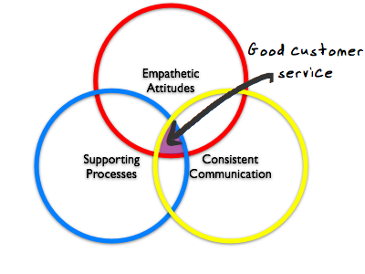
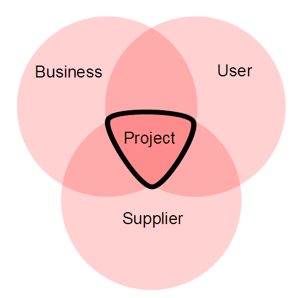

# Project management

## The Perfect Client {#the-perfect-client}

_Date posted: 12 March 2010_

#yam Some years ago, I was working as a learning designer on a national change project which dealt with almost every NHS Hospital Trust in the country. It was being closely monitored by the Prime Minister's Delivery Unit, which meant it had a pretty high profile. The project involved creating online learning materials, a performance support tool, workshop materials, and delivering workshops for Trust change managers designed to help them facilitate change within their organisations. The subject matter was complex and, if adopted, was going to have considerable impact on staff and processes in the hospitals. Thankfully the whole project was a great success. It achieved its measurable target objectives, everything was delivered on time, and within budget. Yes, there were sticky patches - as with **every** project. But what really made this one work was the client. There were some key things within our relationship with the client that made the difference:

1.  The client organisation delegated decisions about the content to one person. That person was the trusted subject matter expert (SME) and he knew what was needed to achieve the aims of the project.
2.  When reporting back to the client-side project board, the SME's role was to explain the decisions he'd made and persuade the project board to sign-off finished work products.
3.  The project board's role was to ratify decisions made by the SME at key milestones in the project.
4.  Materials were reviewed every two weeks during a two-day workshop. Day 1 involved reporting back to the SME on what had been achieved in the previous two weeks. Day 2 was about working together, with the SME, on what would happen in the next two weeks. During these workshops decisions were made.
5.  The SME's role between workshops was to clarify design and content issues with his organisation, ready for the next review workshop.

It's rare to find an organisation that is willing to delegate such responsibility for such a high profile project down to one person. But, when it does, the whole process can become much more iterative and productive.

## The art of user support {#the-art-of-user-support}

_Date posted: 22 March 2010_

#yam When I source websites and tools for people, my primary focus is on providing excellent user support. If my clients aren't confident that they will get help at their point of need, then they will not use the systems I'm providing. The more use they get out of the systems, the more likely they are to come back to me for additional work.Good user support is made up of three elements:

1.  Empathetic attitudes
2.  Underlying processes
3.  Consistent communication

These apply whether you're a single person providing support, or whether you're managing a large IT support desk. If you want to see these principles in action, take a look at [Hostdime](http://www.hostdime.com/). I'm not associated with them, other than I've been a customer of their's for many years. Their support is exemplary.

### Empathetic attitudes {#empathetic-attitudes}

**Everyone** involved in client-facing work must know what it feels like to be one of your customers. You must understand their expectations, and their levels of knowledge and confidence. For some people, this comes naturally. They're able to put themselves in the situation that the customer's facing and think about it from the client's perpective. For others, learning to be empathetic is an ongoing process. Training might help - for example, you could put your systems experts in a situation where they are unconfident, where they don't really understand the language being used, but where they need to get something sorted. Then, use that experience to help them reflect on how their customers feel.

### Underlying processes {#underlying-processes}

This is the easy part when you're on your own. You choose the tools that work best for you, and there's no problem really if you want to change those tools. For example, when working with my (few!) private clients, I use email as the primary communication medium and [Jing](http://www.jingproject.com/) as the means of providing quick video How-to's. [TeamViewer](http://www.teamviewer.com/) is also a great tool for being able to see the client's desktop. But note that it's only free for personal use. You'll need to be doing a lot of support calls to make it worth buying. It's when you start to scale up that you really need to think about your processes. As soon as more than one person is involved in the support system then you will need:

*   Single points of communication between you and the customer. For your own sanity and the client's ease of use, they should only ever see one email address, one web-support address and one phone number.
*   A single place where **all** communication records are stored. There are many help desk systems around. [Jira](http://www.atlassian.com/software/jira/) is an excellent example of an off-the-shelf system, but there are others. Whatever you choose, it must be as complex as you need to maintain effective internal systems, but as simple as possible for the client. Your client should not need to learn how to use your support systems!
*   A means of monitoring, managing and reporting on support calls. This is easier if all your calls are from email or web. If you have telephone support, you may wish to have some way of recording calls for training and coaching purposes.
*   Establised internal routes so that calls can be escalated. Ideally, your first line team will have broad skills, so that they can properly evaluate where a call should go.
*   A means of prioritising calls. This comes down to the client's perception of the importance of the problem, and also the internal reporting that should be showing whether a problem is affecting more than one client.

There's a lot more detail here that I could go into. The [Wikipedia article on Technical Support](http://en.wikipedia.org/wiki/Technical_support) is a good place to start if you want to explore further.

### Consistent Communication {#consistent-communication}

With an empathetic attitude and good underlying processes in place, you should have no problem in being consistent in your communication with your customer. However, there are three things here that would help you greatly:

*   A searchable, intelligent knowledgebase - that contains answers to frequently asked questions. It should be regularly updated, and should have both client and internal facing sections. It would suggest possible solutions immediately to the client when they've asked their question. It would also allow internal teams to collaborate on creating answers ready for publication.
*   Transparent quality control and coaching. We shouldn't be afraid of providing constructive feedback to our support personnel.
*   Always provide your customers with a means of tracking the call themselves, and of adding further details to their call (usually via email).

## Who pays your project manager? {#who-pays-your-project-manager}

_Date posted: 4 July 2011_

Following my Prince2 training, I've gained a new appreciation for the role of the Project Manager. They might not be the person who gets up in front of the cameras, but a good PM is the lynch pin of a successful project. The one thing that caused major confusion on the course was the idea that, unless special safeguards are in place, the PM should never come from the Supplier-side of the project.

Prince2 Organisation

That appeared to run counter to most people's experience. It seemed logical that the PM is best coming from the supplier, since they understand what's needed and when. Take a house building project for example. An inexperienced client would love to have a builder who offered to project manage all the sub-contractors. However, there's a major conflict of priorities here. The PM should always have the client's interests at heart. If they get their pay cheque from the supplier, then that may become difficult. Prince2 does allow exceptions to this rule - but only if additional project assurance processes are put in place, to make sure the project is being run correctly. No wonder good, independent project managers - skilled in specific domains - are worth their weight in gold!

## Tips for working in multiple time zones {#tips-for-working-in-multiple-time-zones}

_Date posted: 5 September 2012_

Going from a job where everything is UK-centric to one where I'm now working with people from across the US, Australia and Europe, I've had to get to grips with time zones pretty quickly. There have been a couple of embarrassing moments when I miscalculated, and ended up joining online meetings an hour late! Half the problem comes because most people tend to use their local time-zone abbreviation. That's fine if you're all in the same country, and know what those abbreviations mean. But when you're working globally it's a recipe for confusion. For example, how is someone to know whether Eastern Standard Time (EST) refers to EST in Australia or EST in North America? Does CST refer to China Standard Time, Central Standard Time (Australia), Central Standard Time (Central and North America), or Cuba Standard Time? It gets even more confusing when some countries (like the UK) change their clocks in the summer (for some strange, historical reason that seems to be to do with farmers in Scotland...). So to work out when a meeting should take place, I need to check with my colleagues which timezone they're in (checking the country to make sure) then work out the time difference between them and me. And everyone else in the meeting will need to do the same. Wouldn't it be much easier if there was a common reference point, so all we had to do was a quick calculation without all the complex looking up of individual time zone differences? Well, it exists. It's called [UTC (Coordinated Universal Time)](http://en.wikipedia.org/wiki/Coordinated_Universal_Time). Every time zone is then defined as being UTC � an integer number of hours. So, currently, I'm at UTC +1 (although that changes in October when the UK goes back to UTC Zero time) Boulder, Colorado, USA, ([Mountain Daylight Time](http://www.timeanddate.com/library/abbreviations/timezones/na/mdt.html)) is at UTC - 6 L'viv, Ukraine (Eastern European Summer Time) is at UTC + 3 So, **the only information anyone needs to provide, to arrange a meeting, is their UTC time zone offset**, ie. UTC+1, UTC-6 and UTC+3 There's no need for anyone to go looking for a [time-zone convertor](http://www.timeanddate.com/worldclock/converter.html) Let's say the meeting is at 08:00 UTC-6 For me, in the UK, the difference between -6 and +1 = +7, so I know that the meeting is at 3pm my time. For colleagues in L'viv, the meeting is at 08:00 + (difference between -6 and +3) = 08:00 + 9 = 5pm their time. Simples! Image credit: [http://en.wikipedia.org/wiki/File:Standard_time_zones_of_the_world.png](http://en.wikipedia.org/wiki/File:Standard_time_zones_of_the_world.png)