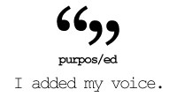

# Comments on Education

## Systemic change in education - it's happening {#systemic-change-in-education-it-s-happening}

_Date posted: 1 July 2007_

via [Graham Atwell](http://www.knownet.com/writing/weblogs/Graham_Attwell/entries/5449685290). The [Independent newspaper](http://education.independent.co.uk/news/article2539348.ece) (a UK broadsheet) has reported that Knowsley council on Mersyside is completely restructing it's secondary (post 11) education. It seems to closely mirror the systemic change that [Angela McFarlane proposed in an interview with Alan November](http://nlcommunities.com/communities/alannovember/archive/2007/05/08/134650.aspx). School is beginning to be more like real life. The Independent reports that Knowsley are abolishing the word "school" for secondary education - instead it will reopen the current schools as "learning centres" in 2009\. These will be open for from early in the morning to late evening - and even at weekends. And it's not just the name that's changing. The curriculum will be much more personalised. Generic skills such as problem solving and thinking will be made explicit. There won't be formal classes or timetables. It will be interesting to see how the children and the staff react to such a radical change of roles. I'm pretty sure that some will fly with it. Learning will have a purpose; more than just a qualification. Teaching will be supportive and assessment formative. It will take the best of what is currently happening in schools and provide an environment in which that best can flourish. I'm pretty sure though that Knowsley will be watched closely. It's the phase change that [Jay Cross described recently](http://internettime.com/?p=881). Such phase changes, in a political climate that prefers the status quo, will need to prove their worth. I do hope it works. Schools and local authorities need an example to follow before they will make such changes. But without systemic change our education system will continue to be stuck in the early 20th century.

## The implications of encouraging self-directed learners {#the-implications-of-encouraging-self-directed-learners}

_Date posted: 31 October 2007_

I was at the Norfolk e-safety & e-learning conference yesterday, [expounding the benefits](http://www.learningconversations.co.uk/main/index.php/mark/2007/10/29/social_networks_the_future_of_cpd) of getting teachers involved in the range of CPD networks that are out there. What we didn't go into was the implications for those teachers and their schools... Based on my own experience, this is what is likely to happen:

*   The teacher will develop many connections with people outside of their school - including across the world;
*   The teacher will end up having more in-depth conversations about their professional practice;
*   These conversations are far more likely to take place with people outside of their school than inside;
*   The teacher will begin to understand that face-to-face events and meetings can be so much more effective if the people involved are part of an existing [community of practice (CoP)](http://www.ewenger.com/theory/);
*   The teacher will gradually give up on "traditional" conferences and training events, knowing that they can get better professional development via their CoPs;
*   The teacher will encourage their students/pupils to go on similar learning journeys and build their own Communities of Practice;
*   The teacher will begin to realise that the existing school structures (curriculum, assessment, timetable, buildings etc) do not fit self-directed learners and will start to look at alternative models.

So what does a school do with that teacher?

## Bill Gates: High Schools are obsolete {#bill-gates-high-schools-are-obsolete}

_Date posted: 10 November 2007_

From Learning Trends 312: 1\. Bill Gates Says High Schools Are "Obsolete": Bill Gates, the Chairman of Microsoft recently gave an incredibly powerful speech about the shortcomings and challenges of United States high schools. Here are a few of his key points and worries: * "By obsolete, I don't just mean that our high schools are broken, flawed and under-funded - though a case could be made for everyone of those points. By obsolete, I mean that our high schools - even when they are working as designed - cannot teach our kids what they need to know today." * "Training the workforce of tomorrow with the high schools of today is like trying to teach kids about today's computers on a 50 year old mainframe." * "Only 1/3 of our students graduate from high school ready for college, work and citizenship." * Gates suggests 3 new "R"'s for redesigned high schools: Rigor, Relevance and Relationships (with mentoring adults). * Gates is urging, and backing these perspectives with grants from his foundation of $1 Billion, focusing on smaller schools, different forms of measurement and greater commitment to getting ALL students across the finish line in terms of readiness for college, work and citizenship. It is worth reading the full text: [http://www.gatesfoundation.org/MediaCenter/Speeches/BillgSpeeches/BGSpeechNGA-050226.htm](http://www.gatesfoundation.org/MediaCenter/Speeches/BillgSpeeches/BGSpeechNGA-050226.htm)

## The pleasure of the new {#the-pleasure-of-the-new}

_Date posted: 24 February 2010_

I like new kit. Not just hardware, but software too. I take new systems and new kit and push them to see a) how they work and b) when they break. That's fine, but I know that people around me don't necessarily want to move at the same pace. At least not using the tools & systems that I use. That's for a variety of reasons - cost, fear, no immediate need etc. That's why my role at work tends to involve elements of looking forward - to see what's coming down the line so that we're ready when it becomes mainstream - and elements of looking at what we're currently using - to make sure we're using it to best effect. So, Bill Lord's post "[Flattening out the rollercoaster](http://lordlit.wordpress.com/2010/02/23/flattening-out-the-rollercoaster/)" had a lot of resonances with me. In it, he describes how he deliberately slowed the pace of change (re. ICT) in his school. They "pulled back the pioneers" and set them to support those were struggling to keep up their understanding of what they were already using. The effect of this was described by a visitor from the [DCSF](http://www.dcsf.gov.uk/): **�You don�t have a huge amount of kit but what you do have is used all of the time.�** That contrasted hugely with my experiences in most schools which contain cupboards (and walls in the case of [IWBs](http://en.wikipedia.org/wiki/Interactive_whiteboard)) **full** of unused software and hardware. Often bought with government seed funding, but with no real idea of how it would be implemented and used effectively. There will always be a role for pioneers - mapping out and testing the future direction. At the other end we mustn't be afraid of getting rid of equipment and systems that are past their useful life. However, the majority of our effort must be in making sure that the direction we choose is taken wholeheartedly so that the most benefit is achieved. Sometimes that will mean a slow-down. Not a stop. Just a slow-down.

## Can you change an organisation from the inside? {#can-you-change-an-organisation-from-the-inside}

_Date posted: 12 July 2010_

Lot's of things are coming together for me at the moment. This post is an attempt to try to mash them together and see what comes out... 1) I'm reading the [Cluetrain Manifesto](http://www.cluetrain.com/). If there was ever a book that says what I've been thinking - this is it:

> Many people in today's world seem to assume that official authorisation is required to learn new things

> At some point you've got to break down and trust people both inside and outside your organisation.

> Does your organisation have any genuine passion to share? Can you deal with such honesty?

> Organisations don't know who their customers are any more.

> The Net is next to impossible to understand unless you've experienced it for yourself.

I could go on, but I'd probably end up quoting from every page... 2) Through Twitter interactions with [Tony Parkin](http://twitter.com/tonyparkin), [Doug Belshaw](http://twitter.com/dajbelshaw), [Eylan Ezekiel](http://twitter.com/eylanezekiel) and a host of other people who have been pushing the boundaries for years, I'm re-engaging with my passion for schools and teaching. We've been saying for years that networks fundamentally change the dynamic of education. That classroom walls can be broken down, that learning is a wider process than that of knowledge transfer from teacher to student. Yet, with all the thinking and fantastic practice that is going on, we still haven't really changed the underlying organisational structures that our schools are based on. I'm not saying throw out the baby with the bathwater. But the trouble is, there just isn't the critical mass of networked people in each institution. **What would happen if they all got together to create a new way of doing education?** 3) A similar situation is happening in corporate learning. There are individuals within L&D teams across the country (and the world) who are connecting, learning how to learn and trying to demonstrate how training has to change not just just to keep up with society but to make training better. **What would happen if they got together to create a new way of doing corporate L&D?** 4) We keep having conferences. [Teachmeets](http://www.teachmeet.org.uk/) are becoming some of the most valuable CPD events for teachers. Yet very little real change is happening at a structural level. 5) We have a choice. We either stay inside the current structures and try to change them from the inside or we leave them. 6) Let's assume, for the moment, that leaving is not an option, so how do we change the current structures? We have to play the game. Use the accepted methods to communicate and make change happen. That means engaging with the regular media and lobbying government (or the management). 7) So here's a proposal. I'm focussing on schools for now:

### Education policy conference {#education-policy-conference}

(Thanks to Eylan for his significant input on this) **Purpose**: To look at education in its widest sense and propose recommendations for government. **Participants**: A mix of 'stakeholders' (eg. teachers, policy-makers, industry leaders, parents, techies, kids!) **Method**:

1.  Prepare the ground with a series of prompt statements (see below) - publicised widely and discussed in various media spaces.
2.  Raise the issues of assessment, curriculum, the place of school in society and the home, infrastructure and ethos.
3.  Participants to contribute to a conference wiki under those headings.
4.  Participants to come prepared to a day's conference to discuss, agree, and map out a 5 year plan towards creating a 21st century education system.
5.  The final statement must have three aspects � it must be written for a policy audience, must show stages of development, and must be simple to sum up.

### Prompt statements {#prompt-statements}

*   The National Curriculum should stay But Ofsted should go
*   Testing must be rigorous but results should not be published
*   Schools have a moral and societal obligation to help shape children's lives to be healthy and respectful of authority
*   If teachers choose resources / suppliers then those choices should be accountable to the community
*   Classrooms should only be used when absolutely necessary
*   The government should appoint [a Chief Education Officer, and an independent advisory board on education](http://opinion.publicfinance.co.uk/2010/06/a-nice-for-education-by-karen-whitby/)
*   The Open University is a model of highly effective, scalable education that [could be replicated across schools and universities nationwide](http://donaldclarkplanb.blogspot.com/2010/06/ou-key-to-future-of-he.html).

So, what do you think? Could this work? Would it make **any** difference? Only if it had a high enough profile.

## 7 reasons not to maintain a school service during closure days {#6-reasons-not-to-maintain-a-school-service-during-closure-days}

_Date posted: 7 January 2011_

Both my children's schools were closed for over three days last week due to snow. It was definitely right to close the buildings, but no explanation came from the schools as to why all teaching and learning activity also had to stop. Both schools have [learning platforms](http://en.wikipedia.org/wiki/Learning_platform) (or [VLEs](http://en.wikipedia.org/wiki/Virtual_learning_environment)). In my view, a school that has embedded usage of these tools in their day to day activity should not need to stop work when the buildings are closed. But here are 7 reasons for schools who don't want to use technology to maintain a service during closure days:

1.  It's too different to how we normally operate, so the students won't be able to handle it.[My response: Why aren't you using these tools to support your normal work?]
2.  Our teachers are not confident in the use of these tools.[My response: Why not?]
3.  Some of the students do not have internet access.[My response: OK. So how are you going to plan ahead so that these students can have access - whether at friends or elsewhere?]
4.  Some of the teachers do not have internet access.[My response: How can a teacher be effective these days without it? How are you going to plan ahead so they can get access when it's needed?]
5.  We don't have a Learning Platform.[My response: You don't need one. Just start by using the masses of free tools listed on [Jane Hart's C4LPT website](http://www.c4lpt.co.uk/Directory/index.html). Or sign-up for [Google Apps for Educators](http://www.google.com/educators/p_apps.html) (also free). When you have worked out what you really need a Learning Platform to do, then you can start to think about buying one to meet your specific needs.]
6.  The students wouldn't do the work anyway.[My response: What are your expectations of the students? What incentives do you already use as part of classroom management? What support do teachers get from Senior Management in handling unwilling learners? Why can't you extend those strategies to online work as well?]
7.  It's extra work for the teachers to produce all the resources required.[My response: Yes, maybe. But there are real, practical benefits to teaching and learning online that will balance it out, such as: automated marking, deeper and broader learning, opportunity for less confident learners to contribute etc (See the [European Education Partnership for more](http://www.eep-edu.org/InnService/Start/what_addval_start.htm))]

What reasons did your school give for not maintaining a service last week? What are their strategies in the case of a long term closure (such as with a flu epidemic)? Are these really practical if they're not already putting those strategies in practice on a day-to-day basis? For more, see the Naace press release on "[Two kinds of school](http://www.naace.co.uk/twokindsofschool)" [Update] Northern Echo news report: [Stranded students log on from home](http://www.thenorthernecho.co.uk/news/8721526.Stranded_students_log_on_from_home_via_web/). What a shame this is still newsworthy!

## A Chartered Institute for Teaching? {#a-chartered-institute-for-teaching}

_Date posted: 18 January 2011_

In the last week, I've spent a fair bit of time talking with colleagues from the education sector.

One of the topics of discussion was teacher professional development, and how we might encourage teachers to take more responsibility for their own learning.

I would contend that any profession worth that name will have continuing professional development at its core. It will be a requirement for remaining a member of that profession.

Not so with teaching (at least in England). The [General Teaching Council for England](http://www.gtce.org.uk/), although being the government-sponsored professional body, has not dared to challenge the unions by imposing professional development requirements on membership. (NB. I'm not anti-union. I was in the [NUT](http://www.teachers.org.uk/) whilst teaching. But sometimes they have too much power to block things that shouldn't be blocked.)

The political will is obviously not there to address this challenge centrally. So, I would propose that, just like the [CIPD](http://www.cipd.co.uk/) (for HR specialists) and [ALT](http://www.alt.ac.uk/) (for Learning Technologists), there should be a Chartered Institute for Teaching (CIT).

Membership would be voluntary, but, over time, such membership would become the badge of choice for a teacher who was committed to their own professional development. The long term goal would be for membership to become a recognised requirement for a teaching post.

Unlike CIPD, I don't see this organisation providing courses or qualifications. Instead it would provide a service whereby teachers could maintain a record of their professional development � choosing to publish some of it as a public portfolio.

By CPD, I don't just mean courses. There's a massive range of CPD opportunities available to teachers, if they would just engage with them.

Professions, such as law, accountancy, medicine etc, all allow their members to maintain records of the CPD hours they have undertaken. I would propose a subtly different model. Instead of measuring the time taken, a better measure would be the amount of thought and effort put in.

The table below is a starting point for such a framework. It will need refinement, I'm sure.

Let's say that to maintain membership in the CIT, teachers need to have achieved 200 CPD points in any 12 month period (measured on a rolling basis). Points can be gained in the following ways:

| Activity | Points awarded | Notes |
| --- | --- | --- |
| Post a tweet tagged with #cpd | 1 | Collected automatically, and displayed on the teacher's CPD portfolio. Up to a maximum of 50 points. |
| Write a blog post tagged with #cpd | 10 | Collected automatically, and displayed on the teacher's CPD portfolio. Up to a maximum of 100 points. |
| Publish a podcast or video tagged with #cpd | 20 | Collected automatically, and displayed on the teacher's CPD portfolio. Up to a maximum of 100 points. |
| Present at a Teachmeet or similar conference | 30 | Added by the teacher and displayed on the teacher's CPD portfolio if they wish. |
| Organise a Teachmeet or similar conference | 30 | Added by the teacher and displayed on the teacher's CPD portfolio if they wish. |
| Attend a Teachmeet or other organised CPD event | 5 | Added by the teacher and displayed on the teacher's CPD portfolio if they wish. |
| Publish the results of Action Research in a recognised journal (perhaps even one published by the CIT?) | 50 | Added manually by the member, and checked by CIT staff. Displayed on the teacher's CPD portfolio if they wish. |
| Achieve 30 points at Post-Graduate level | 100 | Added manually by the member, and checked by CIT staff. Displayed on the teacher's CPD portfolio if they wish. |

The more points you gain over 200, the greater the level of membership. So 200 points gives you member status, whilst 300 would give Advanced status etc.

The rationale I'm working on is that sharing knowledge should be rewarded, and the more thought that has gone into that, the greater the reward.

As I say, the model needs to be refined, and gaps filled in. I'd welcome any feedback ...

a) Do you think a Chartered Institute of Teaching has a future?

b) Do you agree with the membership model

c) Do you agree with the points model?

d) Which of these funding sources would be most viable: freemium (some free services, with benefits for paid-up members), commercial sponsorship, government (as if!) - to be honest I'd like to avoid government funding with all the constraints that puts on things.

e) I envisage this as a non-profit making organisation - with transparency in all aspects at its heart. Would that work for you?

## What did ~~the Romans~~ ICT do for us? {#what-did-the-romans-ict-do-for-us}

_Date posted: 19 January 2011_

[youtube]ExWfh6sGyso[/youtube] In our schools, ICT is often held up as an example of modern thinking - an essential for today's classroom. Yet what real benefit has the massive investment in ICT infrastructure really brought? [Roger Broadie](http://rogerbroadie.wordpress.com/), a number of years ago, developed a model that examined the strategic benefits that ICT can bring to a school: [Added value of ICT for learning](http://www.eep-edu.org/InnService/Start/what_addval_start.htm)We may be seeing some of these, in a small way, with certain enthusiastic teachers, or in a whole-school way when the senior management are really switched on and ready to take the plunge. But it's hard to find examples where real, systemic and long-lasting benefits are being seen that would justify the spending. Ian Yorston discusses this in his [recent article for ATL](http://www.atl.org.uk/publications-and-resources/report/report-2010/feature-schools-ict.asp), but his conclusion is to just start using the technology that the children bring to school. I'm in agreement there in principle, but like [Gareth Davies](http://advisorymatters.naaceblogs.org/2010/10/09/using-the-kids-kit-is-not-the-solution/), can't see it working in practice. My conclusion is somewhat wider reaching. We either stop spending, and accept that, at the moment, there's no real need for ICT in our schools, or we change the way we do education so that ICT can be used to its full potential. I know many, extremely good, teachers who cannot see why they should use ICT at all. They get the results that the schools need (in terms of SATS and GCSE scores). Why should they have the hassle of bringing in something that they are not confident in? Yes, OFSTED demands it, but why? What is ICT adding to these teachers and their students? If we are to see real benefits, I'm with Sir Ken Robinson... [we don't need evolution, we need revolution](http://sirkenrobinson.com/skr/bring-on-the-learning-revolution). Let's take some parts of Roger Broadie's model, and use it to help us rethink what we mean by education:

### Improve access to resources {#improve-access-to-resources}

Our children have access to far more resources (written, audio, video, animation

**Illegal HTML tag removed :** and

people) than we ever did. Yet do we teach them how to plan, how to search, how to evaluate, how to criticise, how to sythesise ideas, how to create and share new resources? What about copyright, creative commons, providing references? This should start in primary school. Not in my experience it doesn't. With this wealth of resources freely available, why do we still insist on exams that rely on memory? Shouldn't we be assessing something deeper than just the ability to recall a quote?

### Extend learning time and provide replicability and scaleability {#extend-learning-time-and-provide-replicability-and-scaleability}

The school year, divided into terms, with long summer holidays, and school days, divided into hour long lessons are artificial constraints (just as is the working day for adults - but that's another post). ICT should enable us to free things up. Should enable us to learn when and where we need to for particular topics/activities. I have only ever come across one example of this - schools in Coventry that got together to deliver A-level English using a combination of video-conferencing, online resources and discussion forums. This was in 2003! Why isn't this the norm now? We have superb reference examples in the [Open University](http://www.open.ac.uk/) and various Online High Schools in the US (eg. [Stanford OHS](http://epgy.stanford.edu/ohs/). [Donald Clark makes a persuasive argument](http://donaldclarkplanb.blogspot.com/2010/10/faceless-schools.html) to use ICT to its full capacity to scale up learning.

### Increase communication {#increase-communication}

This is probably the one area where schools are starting to change. In particular, they are using their websites and the management information systems to provide portals for parents. But again, is that far enough? How many schools have Twitter and Facebook (or whatever comes along next year) accounts? How many know that it's possible to automatically get their school news published on both Twitter and Facebook? Why does news only get published on a printed newsletter once a month? Why not as it happens? Similarly, are we introducing our children to the idea of developing a [personal learning network](http://thefischbowl.blogspot.com/2008/02/my-personal-learning-network-in-action.html) - an evolving, constantly refined group of people who share ideas and resources, and respond to questions? The technology's there to allow this to happen. But are our schools ready for it? There's a lot more to be done to allow ICT to play its full part in our education system. But, all the time our political system is dominated by people who expect education to happen in the way it was done to them, there is really very little point. We might as well stop wasting our money. What do you think?

## What is the purpose of education? {#what-is-the-purpose-of-education}

_Date posted: 9 February 2011_

Part of the [purpos/ed project](http://purposed.org.uk/). In a recent Twitter post, I said that I think that "the purpose of education is to develop a creative society that will ask difficult questions." I've made no mention of children, but, in all the posts in [this distributed conversation](http://purposed.org.uk/archive/), everyone seems to assume that education is something that society does with (or to) the youngest members of that society, until such a point at which they can learn on their own. Actually, from my point of view, we seem to do the opposite. We take children, who are literally "born learners", and we educate the ability to learn out of them, by forcing them through the sausage-machine that is our "education system". As [Lou McGill so eloquently states](http://loumcgill.co.uk/?p=466), from her experience, the state education system "offers a standardised one-dimensional approach that assumes a commonality of potential." How can we expect people to be creative, if we expect them all to achieve certain, set, targets, and disparage certain areas of learning as less important than others? The trouble is, our whole society, politically, economically, socially and educationally, is driven by competition rather than cooperation, on being seen to be better than others, rather than just being. We're all in it. There's almost no escape. It's part of our psyche. Our lives are built on becoming "better than" others. [youtube]w0DUsGSMwZY[/youtube] It takes quite a major rethink about the purpose of life itself to break free of that mindset...

> ... I have learned to be content whatever the circumstances. I know what it is to be in need, and I know what it is to have plenty. **I have learned the secret of being content in any and every situation**, whether well fed or hungry, whether living in plenty or in want. ([Philippians 4:10](http://www.biblegateway.com/passage/?search=Philippians%204&version=NIV) - sorry to my non-religious friends, but it's relevant)

Let's say we do break free of discontentment. What then? What would be the purpose of education if we didn't have to keep proving ourselves? It would be about achieving our individual potential. It would be about helping each other to find out what we are good at, and developing those skills/gifts/talents. Not to be better than someone else, but to be as good as we can get. It would be about encouraging the creative minds we're born with, and developing them - not stifling them. It would be about looking out for injustice and not accepting it. It would be about being able to tell people how we feel, and about dealing with ourselves when we get hurt. It would be about learning about how the behaviour of this amazingly complex universe can be described by the most simple maths (eg. E = mc2 - why???!). It would be about imagining yourself in someone else's shoes, having compassion, and knowing what to do about it. Stephen Downes says it so much better than me in his post: "[Things you really need to learn](http://halfanhour.blogspot.com/2006/08/things-you-really-need-to-learn.html)" So, to summarise, the purpose of education in our current society is to become better than other people. If you're not satisfied with that (and I'm not), then you need to rethink what life is about, and then the purpose of education is to achieve your own, individual potential alongside other people.

## Channel shift in your local school {#channel-shift-in-your-local-school}

_Date posted: 6 October 2011_

You'd think the following would be priorities for a school:

1.  Saving paper and printing costs
2.  Ensuring that parents and students are able to find out information about school activities quickly and easily

Yet my local school at least, still relies of vast quantities of printed letters, sent home by pupil post, and often quickly lost in the piles of paper that tend to accumulate. There is a better way. Imagine a school where only private correspondence gets printed by default. Where parents have to opt-in to receiving letters by pupil post. Instead, letters are uploaded as PDF's to the website. But, wait, how will anyone know that something new has been added? That's the easy bit... If you use software like [Wordpress](http://wordpress.org/) to drive the website, it comes with a simple piece of technology called "Really Simple Syndication" (RSS). You can very easily use this to make sure that anything new gets sent to immediately and automatically to Facebook, Twitter, and people who subscribe by email. It's similar to the [network publishing approach](http://www.learningconversations.co.uk/main/index.php/2010/02/27/network-publishing?blog=5) I use:[.png)](./assets/network_publishing.001(1).png)There are lots of ways to organise stuff inside Wordpress. You could have separate sub-sites for each year group, each with their own design. Or you could organise posts by categories (which makes it easy to attach posts to multiple year groups). Each category can have its own separate RSS feed, so people are only fed the content they want to see. Once the letters and notices are on the site, they then become a valuable resource for when a vital piece of information is forgotten. There's always a central source of information that parents and students know they can get to. In the corporate world, this is known as "[channel shift](http://www.publicnet.co.uk/news/2010/11/26/digital-champion-calls-for-channel-shift-in-public-services/)" (link is to a Publicnet.co.uk report). It takes time and effort to make work, and there will be people who will resist the change - some for good reasons. What you're trying to do is make your communication methods more efficient, by reducing the spend on the input, and increasing the value of the output. When the majority of your parents and students see the value of engaging with you online, and lose the expectation of receiving paper letters every week, then you'll have achieved channel shift. Of course, the ultimate in channel shifting a school would be to make better use of the digital space for teaching and learning. I alluded to this in my post last year about [snow days](http://www.learningconversations.co.uk/main/index.php/2010/12/07/6-reasons-not-to-maintain-a-school-service-during-closure-days?blog=5). Channel shifting away from the need to be in a certain place at a certain time would greatly improve the efficiency of schools, and increase their resilience during times when the school building is not able to be used.

## Breaking down the classroom walls {#breaking-down-the-classroom-walls}

_Date posted: 7 February 2012_

Often, when we think about the idea of introducing ICT into the classroom (whether in schools or in the workplace), we are simply thinking about ways to change what is happening inside the classroom. In these cases the role of the teacher or tutor tends to remain the same as pre-ICT days, as does the way teaching is managed and administered. Good teachers, who were already engaging their students with challenging activities, will continue to do so. Poor teachers, who bore their students rigid with lectures and "read-these-pages-in-the-text-book" activities will also carry on as before - except they'll now perhaps direct students to web-based resources. Those organisations that have **really** grasped the potential of ICT are using it to support systemic changes in the way they work. Some examples:

*   A secondary school in Coventry that rewrote teachers' contracts to allow them to work from home via video and text conferencing
*   A [primary school in Bolton](http://heathfieldcps.net/) that was fed up with having to close the school on snow days and started using simple blogs for online lessons, now builds blogging into the heart of what they do - with [great success](http://www.independent.co.uk/news/education/education-news/blog-early-blog-often-the-secret-to-making-boys-write-properly-2211232.html)
*   Companies are changing from [knowledge-hoarding to knowledge-sharing cultures](http://www.economist.com/node/15350928?story_id=15350928) simply by allowing employees to use corporate micro-blogging sites
*   Companies are making far more use of online meeting software and telephone conferences in order to save on travelling time and the cost of meeting rooms
*   Tamil Children are shown to be able to teach themselves English and molecular with no input from a teacher (Limits to self-organising systems of learning - the Kalikuppam experiment - Sugata Mitra) Athens password required - unfortunately!

In the education and training world, these examples seem to be fairly rare though. Let's think what **could** happen if we really used ICT to its full potential:

*   Teachers & tutors would expect students to submit their work and receive feedback electronically. (Now that's easy - I really don't understand why we don't do it already?)
*   We would only use physical classrooms/meeting rooms when we absolutely have to - when it's the only way to achieve something. Getting everyone together in the same room is using valuable resources both in terms of space and also people's time. Much of the time there is no point other than "it's what we've always done".
*   We would share expertise across schools. But that would need all state-sector teachers to be paid centrally with no competition between schools. Perhaps that's a change too far? But why?
*   We would be able to cope with children entering school when they are ready for it, and moving at the right pace for them - and not have to follow our current "sausage machine" processes that are simply designed to support administration and management rather than learning
*   We would assess people when they are ready to be assessed, not at some arbitrary point in the year
*   Teachers & tutors would be expected to engage in, and contribute to, professional development networks

These are just a few ideas. What do you think would happen to your training or education organisation if we really allowed ICT to be used to its full potential?