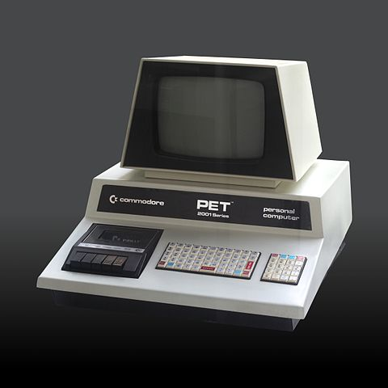

# Computing and ICT in schools {#computing-and-ict-in-schools}

_Date posted: 13 January 2012_

I'm part of the generation of people that had to teach ourselves how to use computers. The classrooms had machines like the [BBC Micro](http://en.wikipedia.org/wiki/BBC_Micro), and [RM 380Z](http://en.wikipedia.org/wiki/Research_Machines_380Z), with very little software (if any), and few teachers that had a clue what to do with them. Similarly our homes had [Sinclair Spectrums](http://en.wikipedia.org/wiki/ZX_Spectrum), [ZX81's](http://en.wikipedia.org/wiki/ZX81) and [Commodore 64's](http://en.wikipedia.org/wiki/Commodore_64). I even had a [Commodore PET](http://en.wikipedia.org/wiki/Commodore_PET) (image below) at one point. The common factor with all of these is that, on booting up, they just came up with something as helpful as:

> > |

Just look at that 300 baud tape deck!

Image credit: [Wikipedia](http://en.wikipedia.org/wiki/Commodore_PET)

We learnt how to program by typing code in from magazines and then working through it to solve all the problems - in a very similar way to children learning a spoken language: mimic and then trial and error. In fact, very similar to the way this modern [Python programming book](http://inventwithpython.com/) works. It's this that launched the games and software industry in the UK, and I expect elsewhere too. But then computers started getting more "friendly". They came pre-populated with software that lets you carry out tasks like word-processing and data manipulation. The focus, in schools, turned to understanding how to best use those software tools, rather than how to make new tools. It's like we've ended up with people able to drive in the safe environment of the left-hand lane (UK & a few other countries only!) of a motorway, but with very little idea of how to make use of all three lanes, or what to do if there's a crash up ahead, and no knowledge whatsoever of how the car actually works or how to tweak it so it can go off-road. This approach has led to ICT becoming a very functional (boring), and unchallenging subject at school. Whereas it could be highly creative, full of opportunities to develop transferable skills in problem-solving and logical thought. I'm not fussed about changing the name from ICT to computing, computer science or whatever. But we do need to make sure that it includes both the functional skills (eg. how to add a new post to your blog) and the computing skills (eg. the concept of write-once / read-many that is used in stylesheets, programming, and database design). So many people have written on this subject already (including [this excellent summary from Daniel Stucke - an assistant headteacher in Manchester](http://danielstucke.com/post/15685474628/bravo-mr-gove-schoolstech-ictcurric)), but I'm so glad Michael Gove has made the decision to push schools towards more of a computing approach. It's one of the few things he's done that I agree with! My only worry is that, as with many of the specialist subjects, there will be a severe lack of suitably confident teachers to take up the challenge - especially now that ICT will not have have any formal programme of study in the national curriculum. Perhaps it's time, again, to provide the equipment (eg. the new, very cheap and very small, [Raspberry Pi](http://www.raspberrypi.org/) computer for kids - which seems to be [all](http://www.bbc.co.uk/news/technology-16424990) [over](http://www.economist.com/blogs/babbage/2012/01/cheap-computing) [the](http://www.guardian.co.uk/education/2012/jan/10/computer-skills-ed-vaizey?newsfeed=true) [media](http://www.bbc.co.uk/news/technology-16544845) this week) and let the students get on with it themselves. Given appropriate challenges - even competition - and access to each other's ideas through social media, there's no reason the new generation of computer scientists can't grow from the ashes of the current ICT lesson. With ICT, almost more than any other subject, you could argue the case for totally individualised learning, with teachers/coaches located anywhere - setting challenges and giving support. In fact, they don't need to be teachers. Just look at any large open-source project and you'll find people doing just that: identifying problems, setting challenges, and providing support. It's a highly scaleable model - based on a meritocracy, rather than any sort of qualification, or even age. The schools just need to be there to monitor and encourage... More reading: [ComputerWorld blog post on open source + Raspberry Pi in education](http://blogs.computerworlduk.com/open-enterprise/2012/01/if-its-an-open-source-world-wheres-the-open-source/index.htm)