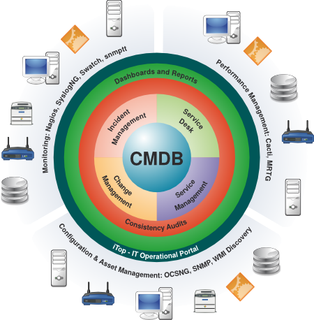
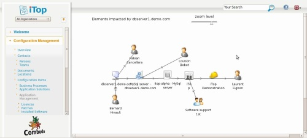

# Configuration management systems - boring but essential {#configuration-management-systems-boring-but-essential}

_Date posted: 27 April 2011_

Like many of us, I get drawn to the new and shiny toys that seem to arrive every week. We are told that each one, whether its hardware or software, is better, faster or more useful than the one before. But change comes at a price. It's fine if it's just you and your wallet. That's your decision. But when other people are involved, whether it's your clients, your team, or even your whole organisation, then any change needs to be carefully managed. The more complex your setup, the harder you'll have to work to prove that the change is either necessary or low impact. Somewhere you'll need a list of everyone that might need to be consulted - every system, business process, and technology that might be impacted by the change you're wanting to introduce. This is where [Configuration Management Databases (CMDB)](http://en.wikipedia.org/wiki/Configuration_management_database) come in. They keep a record of "Configuration Items", their relationships with each other, and any changes that have been applied to them. This then allows organisations to build change management processes with information flowing to the right people at the right time in order to gain approval for changes. CMDB's are a core part of [ITIL� (Information Technology Infrastructure Library)](http://www.itil-officialsite.com/), which, like [PRINCE2](http://en.wikipedia.org/wiki/PRINCE2)� (for project and programme management) comes from the UK's Office of Government Commerce.

> ITIL gives detailed descriptions of a number of important IT practices and provides comprehensive checklists, tasks and procedures that any IT organisation can tailor to its needs. ([From ITIL on Wikipedia 27/4/11](http://en.wikipedia.org/wiki/ITIL))

Configuration management is the part of ITIL that ensures that any changes to configuration items are appropriately:

*   Identified
*   Planned
*   Assessed
*   Approved
*   Tested
*   Communicated
*   Released
*   Maintained

The object is to ensure a stable system, that continues to meet the needs of the organisation, whilst adapting to changes in the environment. Configuration items don't just mean bits of technology (whether software or hardware). They also include core business processes (eg. when and how the organisation communicates with clients, or the process by which a certification is gained by a learner). It's also important to realise that no, one, database is going to contain all the information about all your systems and processes. For example, you will probably have a inventory database that is separate, but needs to be known to (and queryable by) the CMDB. The solution adopted by [Combodo](http://www.combodo.com/) (a French IT Services company) is shown below:It's based around their open-source [iTop](http://www.combodo.com/-Overview-.html) CMDB.If you're working in a place where open source (specifically PHP) applications are accepted and used, then I'd recommend taking a look at iTop. As well as configuration management, it also handles incidents, changes, service contracts (for suppliers and customers), known issues, outage notification, and issue notification from end-users. iTop is designed for people who are offering IT Services to a number of client organisations, and provides dashboards and reporting across all clients and for specific clients. Although, by necessity, the application is complex, it has a consistent and easy to learn interface. To get the best out of it though, you'll need a decent grounding in the ITIL processes - just to help you make decisions about where to store which bits of information.