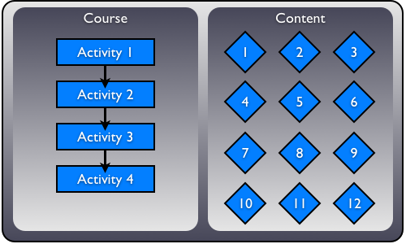

# Courses and Content {#courses-and-content}

_Date posted: 7 December 2009_

I've long been an advocate for separating content from courses, but [Cathy Moore's](http://blog.cathy-moore.com/) [comment](http://www.learningconversations.co.uk/main/index.php/2008/08/05/learning-designers-required-reading-for?blog=5#c841) on yesterday's post has stimulated me to be a bit more explicit about this. Let's put ourselves in the position of the learner (always a good idea for a designer to do). Now, this learner may be a novice in the subject, or may be fairly experienced. Since online learning is often intended for large audiences, we can almost guarantee there'll be a mixture of prior experience. With the typical elearning course, the learner would be pointed to the start of the course, and given a sequential set of activities to do, supported by in-built resources. The learner works through the course, and perhaps finds a couple of useful bits of information. That assumes they haven't fallen asleep or switched off. (BTW - Do you know _anyone_ that has completed one of these typical page-turner courses. I certainly haven't!) The next day, the learner needs or decides to put the ideas into practice. Now where were those useful bits of information? Probably embedded in page 17 of 32\. But there's no way of finding it without walking through the whole course. In a couple of months time, the learner, who is, by now reasonably confident in the subject, realises they need to find out about one particular aspect. They're sure the information is in one of their elearning courses, somewhere. But the only thing the LMS search engine can report on is the metadata attached to the course. It can't search inside the course itself. So how is the learner expected to be able to find information outside the course? The answer's simple. You have two options:

1.  Build your course **inside** your information system, usually known as a content management system (CMS). This is how [w3schools](http://www.w3schools.com/) works. Each page in the tutorials is built within the CMS, and is thus searchable and individually addressable. You can work through sequentially, use the menu to jump to specific pages, or use the search engine to find specific information.
2.  Build your courses separately from your information. Keep the information in the CMS, and build courses in your LMS.

### Implications of separating course and content {#implications-of-separating-course-and-content}

1.  You can't create an information resource and call it a course.
2.  You may realise that simply creating materials for people to read is not always the best learning approach
3.  You may start designing-in activities that require people to **use** the content, perhaps even while interacting with each other
4.  You may realise that your learning management system (LMS) is not adequate as it's simply designed to deliver content in a sequence, and has no concept of activities.
5.  You will need to ensure that learners can jump between course and content relatively seamlessly. This means providing mutual links from course to content and vice versa.

### Implications of _not_ separating course and content {#implications-of-not-separating-course-and-content}

1.  Your information will be locked away inside courses
2.  Your information will have far less impact
3.  If you try to duplicate content inside both courses and an information system then you will end up with one version that is out-of-date
4.  Your learners will only find information if they manage to get to the page in the course that it's on

### Recommendations {#recommendations}

1.  If you have a CMS available, then use it as much as you can
2.  If you haven't got a CMS, then get one. There are hundreds. But which one you choose will depend on your precise needs.
3.  If your subject matter expert (SME) gives you a powerpoint to turn into a course, tell them to put it on the CMS first
4.  Don't allow your course designers to embed information in their courses
5.  Use your LMS to take people through learning activities
6.  Get an LMS that provides flexibility in the activities you choose. Eg. [Moodle](http://moodle.org/)

### Further reading {#further-reading}

[Learning materials and content management systems](http://www.learningconversations.co.uk/main/index.php/2007/07/03/learning_materials_and_content_managemen?blog=5) [Looking for a learner support system](http://www.learningconversations.co.uk/main/index.php/2007/12/14/looking_for_a_learner_support_system?blog=5)