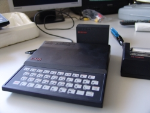

# Creativity, problem finding, education and training {#creativity-problem-finding-education-and-training}

_Date posted: 8 May 2012_

A small crowd of teenagers were gathered in the quiet computer room on a Wednesday afternoon. They watched in astonishment as, on a small square monitor screen appeared a rapid succession of numbers - prime numbers - those numbers that can only be divided by one or itself. To work out such a large sequence manually would have taken hours of painstaking, boring work with a calculator. "How did you do that?" they asked of the young man with the mass of curly light brown hair who was operating the computer. He explained his method, which involved visualising a vast quantity of "pots", one for each integer to be tested - up to 1000, 10 000, or as high as the computer had memory to store. "Start with the small prime numbers, the ones that we know already, like 1, 2 and 3", he stated. "Miss out 1, but, starting with 2, put a marker in the pots that are multiples of 2\. That's an easy set of calculations: 2x2, 2x3, 2x4 etc. Then do the same with 3: 3x2, 3x3, 3x4 etc. "What's the next pot without a marker? Five. So that's a prime. So, do the same thing with that; put markers in 5x2, 5x3 etc. And the next one? Seven. Same again. "You keep going until your halfway to your maximum number. After that there's no point, because any number that's left unmarked times 2 will be bigger than your maximum. "At that point, all the pots that don't have markers will be prime numbers. So, it's just a case of running off a list of those numbers." It was a simple concept, made possible by a combination of the speed of calculations on the computer and the imagination of the person writing the programme. After the demonstration, the rest of the group dispersed to their respective computers; to try it out for themselves, to make their game of [Snakes](http://www.snakegame.org.uk/) run just that little bit faster, or to debug the code they'd spent hours copying in from a magazine. It was the early 1980's. Micro-computers were just finding their ways into schools, and most teachers (like now) did not have the time or the interest to understand them, or their potential. We were left to our own devices and quickly discovered how to control these new machines; to model real and abstract situations from physics, and applied and pure maths, to create games, and to play them. Nothing was networked, or attached to sensors or motors. It was just you, your imagination, and the programme. But we weren't on our own. Some of us grasped some concepts quicker than others, and then demonstrated and explained. Some bought magazines that introduced new ideas. Some went to shows and came back with stories of 16kB RAM packs and 1.2MB floppy disk drives...

ZX81 with RAM pack and printer - Source: [Wikipedia](http://en.wikipedia.org/wiki/File:ZX81_-_rampack_-_ZX_Printer.jpg)

As a group we learnt together, but independent of any formal curriculum, and with no support from anyone that you'd recognise as a teacher. We learnt programming concepts, like loops and procedures. We learnt to be ultra-careful with syntax, to use error messages to help troubleshooting, and to write code together to catch problems quickly. We learnt about operating systems, directories and files. We learnt that programming with variables meant we could change the way our code behaved by simply changing a handful of settings. We learnt the principles of using one chunk of code many times. Time moves on, and nearly 30 years later, as I watch my son using [Minecraft](http://www.minecraft.net/), I see him learning in the same way. No-one is teaching him, but through a combination of [Youtube](http://www.youtube.com/results?search_query=minecraft&search=tag), the [Minecraft wiki](http://www.minecraftwiki.net/wiki/Minecraft_Wiki), discussing with friends, asking questions, and trial and error he is learning to:

*   build virtual worlds with machines and habitats
*   manipulate [complex graphics files](http://www.minecraftwiki.net/wiki/Texture_Packs) to change the look and feel of the worlds and their characters
*   navigate the MacOS directory structure to find the locations for the various graphics files
*   create and unpack zip archives
*   pack and unpack .jar files to add in code modifications
*   search for and find answers to problems in forum postings
*   [deal with mods that crash Minecraft](http://www.minecraftforum.net/topic/73368-how-to-remove-mods-on-a-mac/)
*   manage a Minecraft server, with its security implications
*   manage a Virtual Private Network ([Hamachi](https://secure.logmein.com/products/hamachi/)) so he and his friends can work in the same world

In a similar way to the skills we gained on those Wednesday afternoons, my son and his peers are doing more than unwittingly teaching themselves computer science. They are developing wider thinking and problem-solving skills within a context of sharing, cooperation, peer feedback and self motivated challenges. What can we learn as teaching and learning professionals from these two examples? The key is to stop doing the learning for the student. According to Ewan McIntosh, we spend too much of our professional time trying to find ways to shortcut the learning process, which then simply short changes our learners. They become dependent on the professional, and gradually less capable of independent creative thought. Instead, our job should be one that encourages learners to [**immerse**](http://edu.blogs.com/edublogs/2012/01/design-thinking-2-immersion-dont-give-students-a-problem-to-solve.html) themselves in the problems that surround them, helps them to [**synthesise**](http://www.matthewholloway.com/synthesis.html) the key information relevant to the challenges into connected ideas, facilitates [**ideation**](http://en.wikipedia.org/wiki/Design_thinking#Ideation) (the process of generating and collecting ideas), and provides tools and materials that will help them to [**prototype**](http://edu.blogs.com/edublogs/2010/10/design-thinking-solves-real-problems.html) solutions. The two videos below, both by [Ewan McIntosh](http://edu.blogs.com/), discuss the situation we're currently in, and proposes a solution that is working now around the globe. The solution is called "Design Thinking", a process which encompasses the four components mentioned above: immersion, synthesis, ideation and prototyping. Yes, it will probably take longer if we let learners spend their time immersing themselves in the problem and all its angles rather than spoon-feeding them the specific parts that the curriculum / training objectives dictate. But don't the benefits of developing self-sustaining, creative problem solvers outweigh that? (Perhaps not if you own a factory, or its modern day, data-processing centre equivalent... or am I simply being unnecessarily cynical?)

### The theory {#the-theory}

### The practice {#the-practice}