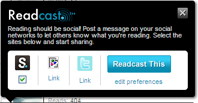

# Internal communication - learning from the web {#internal-communication-learning-from-the-web}

_Date posted: 25 May 2010_

Good content is great. But good content that no-one ever sees is worthless. That's the case with many corporate intranets; pages and pages of stuff that someone thinks is useful or important, but often the messages contained in them just don't get out there. What can we (and in particular people developing content management systems) learn from how people use the web in the outside world? If we can work out what drives them to content, then we will get far better use of our internal content.

### Sort out your search engine {#sort-out-your-search-engine}

Many (most?) people won't go to a specific content-providing site to find stuff. They'll search for it. When I'm looking for stuff on my Mac, I'll rarely trawl through the folders. I'll use Spotlight. Ditto with Google Desktop search on Windows. Now, let's say you provided a search engine that searched both internal resources and external ones, with internal ones highlighted at the top of the list. Even better if you could provide a way of adding that search engine into your company's default browser, where, normally, you'd just search Google or Bing.

### Develop your marketing methods {#develop-your-marketing-methods}

If users don't know that content exists, how will they know to look for it? At its simplest, marketing is a global email notifying people of new content that day/week/month. At its most complex, it's like Amazon - emails sent to individuals that highlights specific new (and old) content based on that person's past behaviour on the site. Most corporate systems would probably settle for something in the middle of those two extremes.

### Work with the water cooler {#work-with-the-water-cooler}

People recommend content to their friends. "Did you see such and such?" is just part of how we relate to each other. If you're using a social-networking/microblogging tool, like Yammer or SocialCast, then consider the potential of having a button next to each item of content that, when clicked, automatically posts "Have you seen [xyz]?" to the user's status? Everyone in their network will then get that message. That's far more powerful, and scalable, than a global email from distant senior management. Your aim here is to get people talking about your content. You can't force them to do it, but you can make it easier to do so. Just look at how [Scribd](http://www.scribd.com/) does it:Then again, if you're not using social-networking tools, these days you really need to justify why you're not taking advantage of the [business benefits they bring](http://socialcast.s3.amazonaws.com/corporate/downloads/Socialcast_cookbook.pdf) [pdf]. Because if you don't provide one, then surely your employees will create one that's under-the-radar - with all the risks that entails.