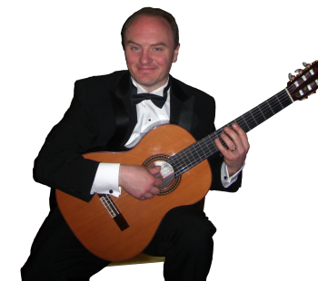

# Lee Myers in concert {#lee-myers-in-concert}

_Date posted: 12 October 2008_

If anyone is around Cromford in Derbyshire on 15th November 2008, then you might be interested in a concert I'm organising. It features Lee Myers, a superb classical guitarist, playing a very accessible collection of pieces. It's a fund-raising event for Lee and his family as they prepare to move to South America to support the growing church there. Tickets cost �8\. With only 60 seats available I'd prefer to have the money in advance (I can take Paypal payments) as I've a feeling demand will not meet supply. The venue is the historic Gothic Warehouse, part of the [Cromford Mills complex](http://www.arkwrightsociety.org.uk/cromford/index.php) - a World Heritage site. For further information or to request a ticket please contact me using [the form on this site](http://www.learningconversations.co.uk/main/index.php?blog=5&disp=msgform&recipient_id=1).Supported by: