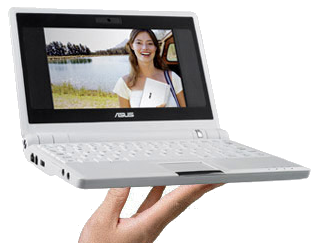
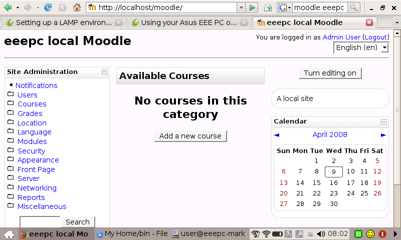

# Moodle running on an Asus eeepc {#moodle-running-on-an-asus-eeepc}

_Date posted: 11 March 2008_

I bought one of the new Asus eeepc's last week.I needed a machine that was ultra-portable but not ultra-expensive. The eeepc fitted the bill exactly. It comes with all the applications I need: Openoffice, Skype, Firefox - plus a whole load of others that will be useful to while away the time on a train! One of the things I really want to do with the eeepc is use it as a platform to demonstrate how [Moodle](http://moodle.org/) works. The machine has got a VGA socket, so can be plugged into a projector. It also runs Linux, which is perfect for running web applications. I followed [Liam Green-Hughes' instructions](http://www.greenhughes.com/content/installing-moodle-asus-eee-pc) to the letter. It took about an hour of concentration. It helped that I knew a bit about how the Linux file system works anyway. This isn't a job for an absolute beginner. But, eventually, with no real hiccups, I ended up with a full blown Moodle 1.9 site running off the eeepc!Moodle 1.9 running on an eeepc