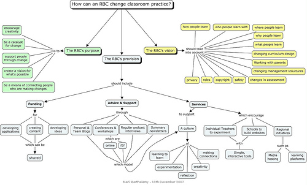

# RBCs and classroom practice {#rbcs-and-classroom-practice}

_Date posted: 17 December 2007_

I spent some time last week with one of England's Regional Broadband Consortiums (RBC). There are ten of these "consortia of LEAs that provide internet services, broadband infrastructure and content for LEAs and schools in their regions" (from [E2BN](http://web.e2bn.net/rbcs.htm)). I gave a short presentation on "How can the RBC change classroom practice". The concept map that I used as a basis for the talk is shown below.  With the inputs being the RBC's purpose & vision, the outputs - ie. what it does - could/should be:

*   Services
*   Advice & Support
*   Funding

_Services_ I believe RBC's should be offering services at three levels: for **individual teachers** (to experiment & to learn), for **schools** (to formalise what is being learnt into whole school initiatives), and for the **region** (to provide safe environments for region-wide initiatives. These services should comprise hosting that allows simple application installation (eg. using [Fantastico](http://en.wikipedia.org/wiki/Fantastico_(web_hosting))), as well as the ability to install other script-based applications (probably using PHP). The RBC should consider providing a media-streaming service (like Youtube), which provides a safer environment for teachers to use with their learners. _Funding_ Alongside the services above, the RBC's are in a position to offer funding for teachers and schools to develop content, applications and ideas. _Advice & Support_ Finally, the RBC can & should be a catalyst for making connections between teachers. It should use technologies such as blogs & podcasts to highlight what is being created and discussed across the region. The key thing for me is that all of the above should be designed to stimulate a culture of:

*   Learning to learn
*   Experimentation
*   Reflection
*   Creativity
*   Making connections