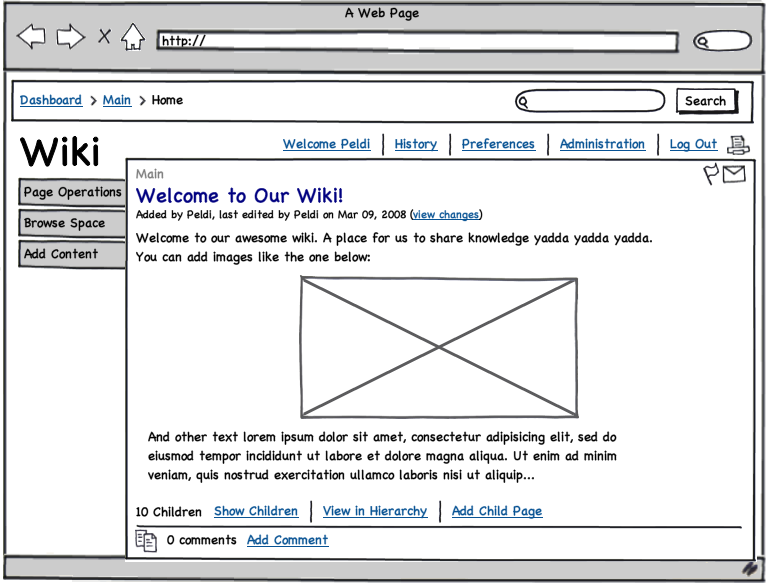

# Review of Balsamiq Mockups {#review-of-balsamiq-mockups}

_Date posted: 11 April 2011_

If you're a designer of any sort of software, whether elearning content, web applications, mobile apps, or even OS-specific applications, this review is for you. It can be really hard to help your clients understand what they're going to get. So, quite often, even at the pre-sales stage, software designers build mock-up designs. This approach can be fraught with problems - especially if you haven't yet got a good feel for what the client's real needs are. Particularly problematic is the expectation that these mock-ups raise. As designers we want to show off all the glitzy features that are possible. If we do it too well, this then becomes the end product, with very little room to manoeuvre. Elearning designers are particularly at risk, with their "rapid-development" tools. Unless you've got a very good relationship with the client, that allows an [agile development approach](http://en.wikipedia.org/wiki/Agile_software_development), then you'll probably be trapped into a [waterfall design methodology](http://en.wikipedia.org/wiki/Waterfall_model). But, if you've given your client a view of the finished-product up-front, then you won't be able to respond to what you later discover about the client's requirements. This is where [Balsamiq Mockups](http://balsamiq.com/products/mockups) comes in. It's an inexpensive software tool that allows you to create page/application designs quickly, with end results that look like hand-drawn screen diagrams, like the one below.Screens can be linked together, so you can easily demonstrate user workflows, and even create interactive PDFs. There are [third-party tools](http://balsamiq.com/support/community) that enable you to create real code from the mockups (although I've not tested any of these!) Virtually any interface element can be quickly and easily built from the pre-built element library, but there's also a [community-generated](http://mockupstogo.net/) set of UI components. I've tried [Axure](http://www.axure.com/), which is a similar tool, but far more expensive and complex. Axure is in the next league up, and designed for helping project teams build major applications. For a small team, or an individual designer, in most cases it's probably a bit over-kill. Balsamiq is invaluable for showing clients what is possible, but without the impression that they're seeing a finished product. There is just a couple of things I hope the team at Balsamiq implement at some point:

1.  Managing large projects can become awkward, as the only way to navigate between pages is through the tabs at the bottom of the screen. This quickly become overcrowded. I believe this is on the roadmap, but then large projects might be better managed with Axure and other, similarly-priced products.
2.  At the moment, if you need to change a menu item that appears on every page of an application, you have to manually change it in each Balsamiq page. There needs to be some way of templating common UI elements so that you only need to change them once for the whole project. Again, it looks like Balsamiq are working on this. I'm looking forward to seeing it soon! [EDIT: @Balsamiq has informed me that the new ["symbols" feature](http://balsamiq.com/support/documentation/symbols) allows just this functionality!]

So, overall, a great little tool. If you've ever needed to build a quick website or application layout and not wanted to worry about code or colours, then I'd highly recommend Balsamiq Mockups. For those viewing this in an RSS reader, there's a video below that shows some of the key features. And, if Balsamiq want to sponsor me for the [Big Issue Bike Ride](http://www.learningconversations.co.uk/main/index.php/2011/02/28/big-issue-bike-ride?blog=5) that would be very gratefully received (although this post was written without any expectation of sponsorship, and I'd have said the same things anyway!) [youtube]aJTuFRaIi_g[/youtube]