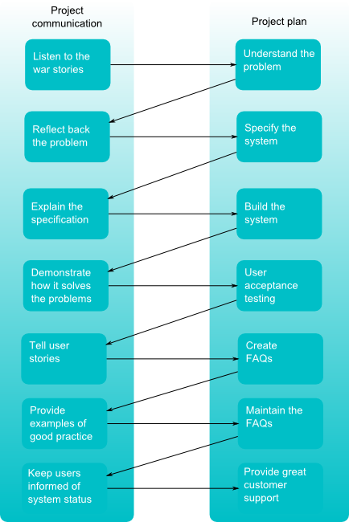

# System rollouts and effective networked communication {#system-rollouts-and-effective-networked-communication}

_Date posted: 12 January 2011_

Last week, [Charles Jennings](http://charles-jennings.blogspot.com/) wrote an important analysis of the [state of training and the need for more "performance support" initiatives](http://charles-jennings.blogspot.com/2010/12/who-needs-training-again.html). It raised a fair bit of discussion. Focussing on new system rollouts for the time-being, here's my take on what's required for a successful rollout.

Rollout and communications plan

Most system rollouts only look at communicating with users once the rollout is ready to begin. This is too late. As the diagram shows, I propose that it's far better to start that communication process as early as possible. But don't despair - even if you're already half way through, you can still use the tools and techniques I suggest. Just start further down the diagram. This communication should be two way. Effective system rollouts need to listen to users, not just tell them what will be happening. Making this communication happen isn't difficult. The tools to do it are freely available, and very simple to set up. The easiest, and probably most effective, tool to use is a networked micro-blogging system such as [Socialcast](https://www.socialcast.com/), [Yammer](https://www.yammer.com/) or [Flowr](http://theflowr.com/) or even a simple, and **license**-free (NB. NOT free!) [WordPress/BuddyPress](http://buddypress.org/) site.

### Wanted: Community engagement lead {#wanted-community-engagement-lead}

You'll need to have someone on board who's responsible for community engagement. Let's say that's you... Ideally you'll already have quite a good network within the organisation. If not, you'll need to build one pretty quickly, mainly by being useful! Start by asking questions (on the blog) about the war stories you're hearing. Talk about the stories you're hearing offline too... Try to get to the heart of the real problem. When you feel you've understood the problem, write it down in words that your users will understand. Post it on the project blog. Encourage comments. All this should help your business analyst to specify what's required from the system. Your job is then to explain what has been specified. Set expectations. Don't over-promise.

### Keep listening {#keep-listening}

You'll (hopefully) get more comments back. Whatever you do, don't ignore them. When you stop showing that you're listening, that's when your potential champion users will disengage from the process. Once the system is built, it will be your job to show it in action. Use a tool like [Jing](http://www.techsmith.com/jing/) to create quick demonstrations of the system solving some of the problems your users raised at the beginning. If that's not appropriate, build some quick annotated Powerpoints (or similar). Bring in some of your most vociferous commenters to do the User Acceptance Testing. Again, it's these people who will become your champions. Watch them use the system. By doing so you will quickly pick up the pinch points - the places where users will stumble and not be sure what to do. (With one system I looked at today that was on the first page!!!) If the testing is successful, consider videoing the champions talking about their experiences, and how they think the system will help. You do have a way of distributing video in your organisation, don't you? If the testing is not successful, explain why. (Although, by this time, your network of champions will probably be doing so already...) Again, keep it real. Set expectations that you believe can be achieved. Use the results of the testing to build Frequently Asked Questions. Don't forget, these won't just be technical (how-do-I) questions. A lot of them will be why-do-I - without that understanding many people won't get very far. Use your blog to provide examples of good practice (eg. [Rapid elearning blog](http://www.articulate.com/rapid-elearning/)), preferably with pictures, videos or screen-capture movies. Highlight what your champions are doing. Give them recognition and they'll help you by becoming advocates and trainers. As people use the system, and raise support calls, you should maintain the FAQs, and monitor and respond to comments raising further questions. Ideally your systems will have automated status monitoring that users can check out if they're having problems. If not, then make sure that someone is responsible for immediately publicing issues as soon as they occur (eg. [Hostdime](http://status.hostdime.com/) - an exemplary company for support and customer communication). For one thing it will reduce support calls, but it will also improve the reputation of the system team, as users will know they're being kept informed. Finally, I've said you need to provide great customer support. I've dealt with that in a previous post, but all the work you've done up to now will provide an incredibly useful foundational knowledge-base.

### Networked communication is key {#networked-communication-is-key}

At the heart of this whole user support / training / communication initiative is a very simple networked communication system. Yes, you'll still need some traditional communications for those people who choose to keep separate from the network. But, by making use of the connections that already exist between people you'll find your system rollout a whole lot easier. Take a look at the short presentation below to see why.**[Getting the message across](http://www.slideshare.net/berthelemy/getting-message-across)**

**Illegal HTML tag removed :** <param name="movie" value="http://static.slidesharecdn.com/swf/ssplayer2.swf?doc=gettingmessageacross-100609090553-phpapp01&amp;stripped_title=getting-message-across&amp;userName=berthelemy"><param name="allowFullScreen" value="true"><param name="allowScriptAccess" value="always"><embed name="__sse4451972" src="http://static.slidesharecdn.com/swf/ssplayer2.swf?doc=gettingmessageacross-100609090553-phpapp01&amp;stripped_title=getting-message-across&amp;userName=berthelemy" type="application/x-shockwave-flash" allowscriptaccess="always" allowfullscreen="true" width="425" height="355">

View more [presentations](http://www.slideshare.net/) from [Mark Berthelemy](http://www.slideshare.net/berthelemy).Such a communication tool need not just be for system rollouts. In fact, I'd recommend that every organisation of more than 12 people considers implementing one. The larger the organisation the more useful it can become - for performance support, knowledge sharing, and for identifying issues before they become problems.