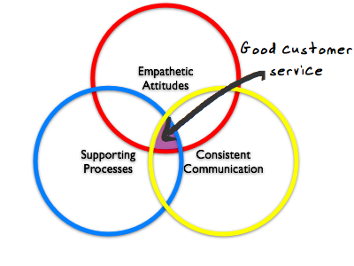

# The art of user support {#the-art-of-user-support}

_Date posted: 22 March 2010_

#yam When I source websites and tools for people, my primary focus is on providing excellent user support. If my clients aren't confident that they will get help at their point of need, then they will not use the systems I'm providing. The more use they get out of the systems, the more likely they are to come back to me for additional work.Good user support is made up of three elements:

1.  Empathetic attitudes
2.  Underlying processes
3.  Consistent communication

These apply whether you're a single person providing support, or whether you're managing a large IT support desk. If you want to see these principles in action, take a look at [Hostdime](http://www.hostdime.com/). I'm not associated with them, other than I've been a customer of their's for many years. Their support is exemplary.

### Empathetic attitudes {#empathetic-attitudes}

**Everyone** involved in client-facing work must know what it feels like to be one of your customers. You must understand their expectations, and their levels of knowledge and confidence. For some people, this comes naturally. They're able to put themselves in the situation that the customer's facing and think about it from the client's perpective. For others, learning to be empathetic is an ongoing process. Training might help - for example, you could put your systems experts in a situation where they are unconfident, where they don't really understand the language being used, but where they need to get something sorted. Then, use that experience to help them reflect on how their customers feel.

### Underlying processes {#underlying-processes}

This is the easy part when you're on your own. You choose the tools that work best for you, and there's no problem really if you want to change those tools. For example, when working with my (few!) private clients, I use email as the primary communication medium and [Jing](http://www.jingproject.com/) as the means of providing quick video How-to's. [TeamViewer](http://www.teamviewer.com/) is also a great tool for being able to see the client's desktop. But note that it's only free for personal use. You'll need to be doing a lot of support calls to make it worth buying. It's when you start to scale up that you really need to think about your processes. As soon as more than one person is involved in the support system then you will need:

*   Single points of communication between you and the customer. For your own sanity and the client's ease of use, they should only ever see one email address, one web-support address and one phone number.
*   A single place where **all** communication records are stored. There are many help desk systems around. [Jira](http://www.atlassian.com/software/jira/) is an excellent example of an off-the-shelf system, but there are others. Whatever you choose, it must be as complex as you need to maintain effective internal systems, but as simple as possible for the client. Your client should not need to learn how to use your support systems!
*   A means of monitoring, managing and reporting on support calls. This is easier if all your calls are from email or web. If you have telephone support, you may wish to have some way of recording calls for training and coaching purposes.
*   Establised internal routes so that calls can be escalated. Ideally, your first line team will have broad skills, so that they can properly evaluate where a call should go.
*   A means of prioritising calls. This comes down to the client's perception of the importance of the problem, and also the internal reporting that should be showing whether a problem is affecting more than one client.

There's a lot more detail here that I could go into. The [Wikipedia article on Technical Support](http://en.wikipedia.org/wiki/Technical_support) is a good place to start if you want to explore further.

### Consistent Communication {#consistent-communication}

With an empathetic attitude and good underlying processes in place, you should have no problem in being consistent in your communication with your customer. However, there are three things here that would help you greatly:

*   A searchable, intelligent knowledgebase - that contains answers to frequently asked questions. It should be regularly updated, and should have both client and internal facing sections. It would suggest possible solutions immediately to the client when they've asked their question. It would also allow internal teams to collaborate on creating answers ready for publication.
*   Transparent quality control and coaching. We shouldn't be afraid of providing constructive feedback to our support personnel.
*   Always provide your customers with a means of tracking the call themselves, and of adding further details to their call (usually via email).