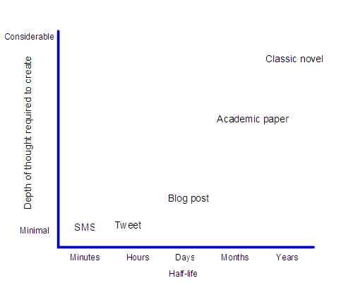

# The demise of global conversation {#the-demise-of-global-conversation}

_Date posted: 7 January 2011_

Reading Ewan Macintosh's recent post about [time zones killing real global thinking](http://edu.blogs.com/edublogs/2010/11/the-real-digital-divide-time-zones-kill-truly-global-thinking.html), I realised why some of my posts seem to "take off", while others die quietly. (And, no, I don't think all my posts are equal in quality. It's just that some of the ones I carefully crafted haven't seemed to have the readership I would have expected / hoped for.) I think Ewan's right when he says:

> Twitter has, for most folk, become their aggregator of choice. No longer do blog posts have a half-life of 24 hours, happily resting in your Google Reader until you launch it in the morning (your morning). Instead, your blog post has to hit a sweet spot where the maximum number of connectors and spreaders are awake, at their machine and ready to press "Retweet". That means hitting "Publish" at a time convenient to the mass of educators on the East Coast US, with a half-life of minutes before it is lost in the stream of other thoughts, resources and locker-room banter about baseball. The conversations have also disappeared from most of the blogs that I, at least, read from outside the US and Canada. They're maybe happening on Twitter, but are now dislocated from their origins, impossible to trace back, and even more impregnable to those coming in 24 hours late.

When you use Twitter, there's this constant nagging feeling that you're missing something important. And it's true. Unlike an RSS reader, which stores stuff until I'm ready to read it, Twitter posts will last a very short time. Where are we going with our conversations? Do we want fast food, and immediate gratification? Or are we going to take time to really think and really communicate?