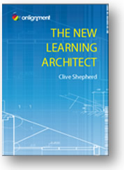

# The New Learning Architect {#the-new-learning-architect}

_Date posted: 4 February 2011_

I'm reading [Clive Shepherd's](http://clive-shepherd.blogspot.com/) recently published book "[The New Learning Architect](http://onlignment.com/thenewlearningarchitect/)" at the moment. I got a free copy, on condition that I write a review of the book. But this is a book that I would actually go and buy. If you work in any aspect of learning & development or training, this really is a "must read". It looks at the role of the learning architect (someone who works with the client to provide a solution, not someone who takes orders from a client), briefly covers some theories around learning and neuroscience, and then goes on with a whole set of example learning opportunities, covering:

*   Formal learning
*   Non-formal learning
*   On-demand learning
*   Experiential learning

Interspersed with these are profiles of 10 people he classes as learning architects, looking at what they've done in their organisations and what they've learnt in the process. Some of the names you'll know, others will be new I'm sure. The book is doing three things for me:

1.  Putting a framework around the job title (Learning Solutions Architect) that I've had for over 5 years
2.  Providing models and examples that I can use with clients who continue to ask for products rather than solutions.
3.  Making me dig far more deeply into the neuroscience research surrounding our field than I ever thought I would!

### Some highlights from the first couple of chapters {#some-highlights-from-the-first-couple-of-chapters}

"... it is neither sufficient nor excusable for the learning architect to act as order taker." p.8 "There can be no such thing as a technophobic learning architect, any more than there is an architect of buildings who hasn't come to terms with the basics of plumbing and electrics." p.13 "When the knowledge that employees need to do their jobs changes so rapidly, it becomes pointless to try and teach it all." p.17 "Resources play a far greater role in the overall learning landscape than do courses." Nick Shackleton-Jones profile p.30 There will be more highlights as I digest this really rather excellent book. Thanks Clive!