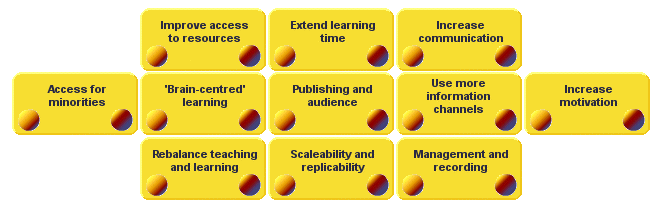

# What did ~~the Romans~~ ICT do for us? {#what-did-the-romans-ict-do-for-us}

_Date posted: 19 January 2011_

[youtube]ExWfh6sGyso[/youtube] In our schools, ICT is often held up as an example of modern thinking - an essential for today's classroom. Yet what real benefit has the massive investment in ICT infrastructure really brought? [Roger Broadie](http://rogerbroadie.wordpress.com/), a number of years ago, developed a model that examined the strategic benefits that ICT can bring to a school: [Added value of ICT for learning](http://www.eep-edu.org/InnService/Start/what_addval_start.htm)We may be seeing some of these, in a small way, with certain enthusiastic teachers, or in a whole-school way when the senior management are really switched on and ready to take the plunge. But it's hard to find examples where real, systemic and long-lasting benefits are being seen that would justify the spending. Ian Yorston discusses this in his [recent article for ATL](http://www.atl.org.uk/publications-and-resources/report/report-2010/feature-schools-ict.asp), but his conclusion is to just start using the technology that the children bring to school. I'm in agreement there in principle, but like [Gareth Davies](http://advisorymatters.naaceblogs.org/2010/10/09/using-the-kids-kit-is-not-the-solution/), can't see it working in practice. My conclusion is somewhat wider reaching. We either stop spending, and accept that, at the moment, there's no real need for ICT in our schools, or we change the way we do education so that ICT can be used to its full potential. I know many, extremely good, teachers who cannot see why they should use ICT at all. They get the results that the schools need (in terms of SATS and GCSE scores). Why should they have the hassle of bringing in something that they are not confident in? Yes, OFSTED demands it, but why? What is ICT adding to these teachers and their students? If we are to see real benefits, I'm with Sir Ken Robinson... [we don't need evolution, we need revolution](http://sirkenrobinson.com/skr/bring-on-the-learning-revolution). Let's take some parts of Roger Broadie's model, and use it to help us rethink what we mean by education:

### Improve access to resources {#improve-access-to-resources}

Our children have access to far more resources (written, audio, video, animation

**Illegal HTML tag removed :** and

people) than we ever did. Yet do we teach them how to plan, how to search, how to evaluate, how to criticise, how to sythesise ideas, how to create and share new resources? What about copyright, creative commons, providing references? This should start in primary school. Not in my experience it doesn't. With this wealth of resources freely available, why do we still insist on exams that rely on memory? Shouldn't we be assessing something deeper than just the ability to recall a quote?

### Extend learning time and provide replicability and scaleability {#extend-learning-time-and-provide-replicability-and-scaleability}

The school year, divided into terms, with long summer holidays, and school days, divided into hour long lessons are artificial constraints (just as is the working day for adults - but that's another post). ICT should enable us to free things up. Should enable us to learn when and where we need to for particular topics/activities. I have only ever come across one example of this - schools in Coventry that got together to deliver A-level English using a combination of video-conferencing, online resources and discussion forums. This was in 2003! Why isn't this the norm now? We have superb reference examples in the [Open University](http://www.open.ac.uk/) and various Online High Schools in the US (eg. [Stanford OHS](http://epgy.stanford.edu/ohs/). [Donald Clark makes a persuasive argument](http://donaldclarkplanb.blogspot.com/2010/10/faceless-schools.html) to use ICT to its full capacity to scale up learning.

### Increase communication {#increase-communication}

This is probably the one area where schools are starting to change. In particular, they are using their websites and the management information systems to provide portals for parents. But again, is that far enough? How many schools have Twitter and Facebook (or whatever comes along next year) accounts? How many know that it's possible to automatically get their school news published on both Twitter and Facebook? Why does news only get published on a printed newsletter once a month? Why not as it happens? Similarly, are we introducing our children to the idea of developing a [personal learning network](http://thefischbowl.blogspot.com/2008/02/my-personal-learning-network-in-action.html) - an evolving, constantly refined group of people who share ideas and resources, and respond to questions? The technology's there to allow this to happen. But are our schools ready for it? There's a lot more to be done to allow ICT to play its full part in our education system. But, all the time our political system is dominated by people who expect education to happen in the way it was done to them, there is really very little point. We might as well stop wasting our money. What do you think?