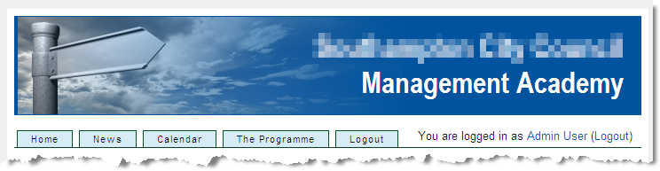

# Working with Moodle themes {#working-with-moodle-themes}

_Date posted: 13 January 2011_

Moodle is well known for a slight lack of design flair in the out-of-the-box theme packs. That's fine. They still work. Often, though, we'll need to redesign the overall look and feel of a Moodle site. Perhaps you need to make it match an existing website, or you just need something that's more in keeping with your particular organisation.

### Things to note before you start {#things-to-note-before-you-start}

Firstly, you don't need to start from scratch. In fact, I would recommend strongly that you don't! Moodle is a very complex application, with many different parts of the interface that need styling. So, I always start with an existing theme and build on that. Secondly, remember that each upgrade to Moodle may add new interface elements. If you're not careful these will break your theme. Follow the guidelines below and you should be OK. Thirdly, Moodle themes cascade. This means that you can build your theme pack so that Moodle starts by reading the **standard** theme, which will always be kept up-to-date with regard to new interface elements. Once the standard theme is read in, then you can add in your customised theme on top.

### Step-by-step guidelines to creating a new theme {#step-by-step-guidelines-to-creating-a-new-theme}

1.  Get yourself a locally hosted version of Moodle. You'll find it a lot quicker to build your theme here. It's very easy to install Moodle on both Windows, MacOSX and Linux. [Instructions are here](http://docs.moodle.org/en/Installing_Moodle).
2.  Create a new folder in the /themes directory. Remember not to have spaces or non-alphanumeric characters in the folder name.
3.  Copy all the files from /themes/standardwhite into your new theme folder. You will see that standardwhite is a custom theme built on top of the main standard theme.
4.  Use Firefox as your browser, with the [web-developer toolbar](https://addons.mozilla.org/en-US/firefox/addon/60) and [ColorZilla colour picker](https://addons.mozilla.org/en-US/firefox/addon/271) add-ins. Without these, or something similar, your job becomes ten times harder.
5.  Understand how to use the config.php file within the theme pack. Especially how it is used to pull in css files from the **standard** theme, and also from another theme which you would like to act as a parent. If you understand this, it makes building slightly-tweaked themes for specific courses or course categories a whole lot easier.
6.  Create one css file in your theme folder, called overrides.css. Use this to contain any css commands that are specific to your theme.
7.  Add _overrides_ to the line in config.php that starts $THEME->sheets = ... so it reads **$THEME->sheets = array('overrides');**NB. I normally remove the gradients.css file from the files I copied in from the standardwhite theme. It usually becomes redundant when I created the new theme.
8.  Use the header.html and footer.html files to add in any extra styled divs that you might want to use to wrap the page or to add in horizontal menu bars. You can see both in the image below:Remember that, if you open a div in the header, you will need to close it in the footer.
9.  Also in header.html add in any logos or other images. Again, you might want to add extra styled divs here, remembering to add those styles to the overrides.css file.
10.  As with all css, start with the big things you want to change: link colours, page backgrounds, overall font styles etc. Then, using the web-developer toolbar, find the specific page elements that need changing, eg. #left-column, #right-column and .sideblock and tweak those.
11.  One thing I always do, in my overrides.css file, is add the lines: `/* needed to remove left & right bars */ #course-view .section .right a, #course-view .right { display:none; } #course-view .section td.left { display: none; } /* But display for editing */ .editing#course-view .section .right a, .editing#course-view .right { display:inline; } .editing#course-view .section td.left { display:inline; }` These tidy up the course view for students, by hiding extraneous information such as topic numbers, and confusing functionality such as the hide topics button.

### More information {#more-information}

For more detailed reference material on themes development please see the following sites: [Moodle Docs: Make your own theme](http://docs.moodle.org/en/Make_your_own_theme) [Moodle Docs: Creating a custom theme](http://docs.moodle.org/en/Creating_a_custom_theme) [Moodle Docs: Theme basics](http://docs.moodle.org/en/Theme_basics) To see what's possible with Moodle themes, see the [Moodle themes database](http://moodle.org/mod/data/view.php?id=6552)

### Update {#update}

For a visual guide to Moodle theming see [Julian Ridden's post](http://www.moodleman.net/archives/40) which takes you through the whole process of creating a theme to match a client's website.